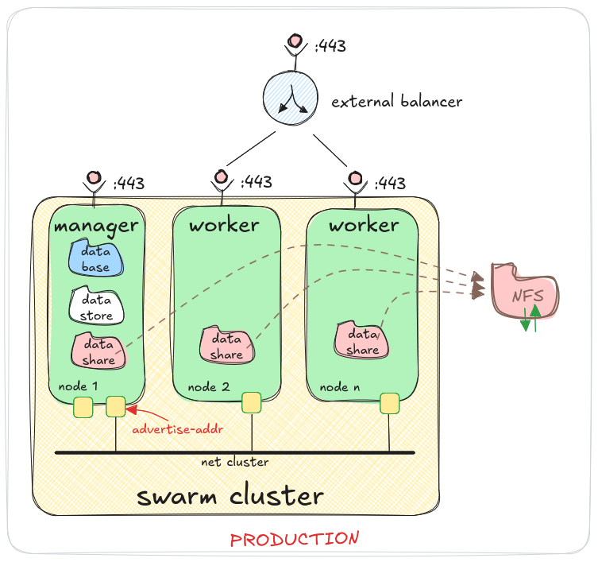

# Migasfree Swarm

This project runs the Migasfree Server Suite 5 on [Docker Swarm](https://docs.docker.com/engine/swarm/).

## Project Directory Structure

* `build`: Source code for the Docker images.
* `doc`: Documentation.
* `images`: Directory containing pre-built Docker images.
* `migration`: Migration script from version 4.
* `test`: Testing scripts.

## Testing Environment Architecture


* The environment variable `DATASHARE_FS` should be set to `local`.

* All data is stored in `local volumes` on `node 1`.

* In this context, `datashare` refers to the volume named `migasfree-swarm`.

## Production Environment Architecture



* The Swarm cluster handles both **port 80** and **port 443**; however, only port 443 is shown in the diagram for clarity.

* The environment variable `DATASHARE_FS` should be set to `nfs`.

* Data is stored on an `external NFS volume` outside the Swarm cluster, except for the `database volume` ([PostgreSQL](https://www.postgresql.org/)) and the `datastore volume` ([Redis](https://redis.io/)), which are kept local for better performance.

* In this context, `datashare` refers to the volume named `migasfree-swarm`, which is available on all nodes in the cluster.

* `Multiple network interfaces`: If the node has more than one interface, you must specify the `advertise-addr`, which is the IP address of the network interface connected to the cluster network.

## Requirements

#### 1. FQDN & DNS

* Choose a suitable `FQDN` for your Migasfree server, e.g., `migasfree.mydomain.com`.

  The `FQDN` and the following `subdomains` must resolve to the server's IP. Configure them in your `Domain Name Service (DNS)`.

* For `testing purposes` only, you can add the domain names to your `desktop machine` to access Migasfree services by editing the `/etc/hosts` file:

  ```/etc/hosts
  x.x.x.x <FQDN>
  x.x.x.x portainer.<FQDN>
  x.x.x.x datastore.<FQDN>
  x.x.x.x database.<FQDN>
  x.x.x.x datashare.<FQDN>
  x.x.x.x worker.<FQDN>
  ```

#### 2. NFS

* In a `Production Environment`, an `NFS server` is required so each Swarm cluster node has access to the data. Refer to [NFS install](doc/nfs.md)

  * Disk SPACE VOLUME >= 1TB

  During deployment, set `DATASHARE_FS` to `nfs`

  ```txt
  DATASHARE_FS (local | nfs): nfs
  ```

* In a `Testing Environment` you can use a `local` volume on the swarm manager node where the stack is deployed.

  During deployment, set `DATASHARE_FS` to `local`

  ```txt
  DATASHARE_FS (local | nfs): local
  ```

  In this `local mode`, data will only be accessible on the manager node where the deployment takes place, used for testing on a `single-node` Swarm cluster.

#### 3. Swarm node hardware

* RAM >= 16 GB
* CPU >= 4
* Disk SPACE SYSTEM >= 80 GB

#### 4. Swarm node software

* [Install docker engine](https://docs.docker.com/engine/install) on each Swarm node.

## Deployment

* On the host that will act as the `Swarm manager`, create an empty directory and run:

  ```bash
  # Example of creating an empty directory
  #     mkdir /data/cluster
  #     cd /data/cluster

  docker run --detach=false --rm -ti -v $(pwd):/stack -v /var/run/docker.sock:/var/run/docker.sock  migasfree/swarm:5.0-beta-3 config
  ```
  

* Initial configuration:
  ```txt
  (for nfs)

  DATASHARE_FS (local | nfs): nfs
  DATASHARE_SERVER (x.x.x.x): 172.0.0.20
  DATASHARE_PATH (/exports/migasfree-swarm):
  ```

  ```txt
  (for local)

  DATASHARE_FS (local | nfs): local
  ```

 * Two files will be created in the directory: `env.py` and `migasfree-swarm`.

  * Check the contents of `env.py`

    ```bash
    cat env.py
    ```
    Example output:

    ```txt
    DATASHARE_FS='nfs'
    DATASHARE_SERVER='172.0.0.20'
    DATASHARE_PATH='/exports/migasfree-swarm'
    DATASHARE_PORT='2049'
    ```

## Downloading images

* Although it is not strictly necessary, you can pre-download the images we will need now.

  ```
  ./migasfree-swarm pull
  ```

## Deploying the Stack

  * Deploy the `Migasfree stack` by running:

    ```bash
    ./migasfree-swarm deploy
    ```

    During deployment:
    ```txt
    STACK (): inv
    FQDN (migasfree.acme.com): inv.org

    Warning! This system is not a Swarm node.
    Do you want to create a manager node? (Y/n):y

    ```

  * You can monitor the services by visiting  https://<FQDN>/services/status.

## Undeploying the Stack

* To `undeploy` the `Migasfree stack`, run:

  ```bash
  ./migasfree-swarm undeploy
  ```

  You can redeploy it with:

  ```bash
  ./migasfree-swarm deploy
  ```

## Logins

  * To access the `administration consoles`, visit `https://<FQDN>/services/status`. View the credentials by running:

    ```bash
    ./migasfree-swarm secret
    ```

    Example credentials:

    ```txt
    proxy & portainer:

        ryuPnPkU:rPi3iHdjBUoE0RudZZo6R53tPDifRD

    Stack inv:

        admin:ajwtcC788fkipE5nh2ZU0Hcmlrj4tR

    ```

    The format is `username:password`.

    

    More information about the [consoles](doc/consoles.md)

## Production Consoles

* To disable consoles that are unnecessary in production:

  ```bash
  ./migasfree-swarm consoles-pro
  ```

  This disables the database, datastore, and worker consoles.

## Development Consoles

* Enable all development consoles:

  ```bash
  ./migasfree-swarm consoles-dev
  ```

## Data Persistence

* In Docker, volumes provide data persistence by allowing data generated and used by containers to be stored outside the container's lifecycle. Even if a container is deleted or recreated, volumes persist on the host’s filesystem, ensuring that data is not lost. This allows containers to securely and efficiently access shared or persistent data, such as databases or configuration files, beyond the container's lifespan.

  1. Migasfree Swarm uses two **local volumes** for storage:

     * `database` volume: Stores the PostgreSQL database.

     * `datastore` volume: Stores the Redis database.

     You can specify on which node of the Swarm cluster these volumes should reside by using **labels on the nodes**. The labels are:

     * for the PostgreSQL volume.

       ```txt
       database=true
       ```

     * for the Redis volume.

       ```txt
       datastore=true
       ```

     Only **one instance** of each of these volumes can exist in the cluster at a time.

  2. There is also a third volume called `migasfree-swarm`, which is used to store various types of information, including certificate files, Portainer data, credentials, and additional data like repositories and software packages managed by Migasfree.
  
     The `migasfree-swarm` volume can be configured in two ways:

     * Local: Used for **testing** or when the Swarm cluster has only **a single node**. Configure this by setting the environment variable:

       ```
       DATASHARE_FS=local
       ```

     * NFS (Network File System): Used for multi-node setups. Data is stored on an NFS server, and **each node in the cluster** has an **volume of type NFS** pointing to the NFS server. Configure this by setting the environment variable:

       ```
       DATASHARE_FS=nfs
       ```

  An example of what it would look like when listing volumes with Docker, when `STACK=inv`, would be: 

  ```txt
  # docker volume ls
  DRIVER    VOLUME NAME
  local     inv_database
  local     inv_datastore
  local     migasfree-swarm
  ```

## Certificates

TODO Certicates

## Backups

Both PostgreSQL and Redis databases are automatically and periodically backed up as a dump in the volume named `migasfree-swarm`.

These database dumps can be found at `https://datashare.<FQDN>/files/dump/`. The file `migasfree.sql` corresponds to PostgreSQL, and `dump.rdb` to Redis.

The `BACKUP_CRON` variable in the `env.py` file of the stack defines the frequency of this dump process.

Therefore, backing up the `migasfree-swarm` volume will safeguard all data, including the databases. It is **your responsibility** to ensure that a backup of your entire Migasfree cluster is performed on storage that is independent of both the cluster nodes and the NFS server.

- If `DATASHARE_FS=nfs`, you must copy the exported folder from the NFS server.
- If `DATASHARE_FS=local`, copy the folder `/var/lib/docker/volumes/migasfree-swarm/_data`.

## Disaster Recovery

Having regular and consistent backups is essential for disaster recovery. In the event of catastrophic data loss, these backups can be used to restore your Docker volumes and recover your data. Always ensure you have a clear and tested recovery plan in place.

You can restore the database and datastore volumes as follows (ensure the dump files you want to recover are available at `https://datashare.<FQDN>/files/dump/`):

1. Undeploy the stack:
    ```bash
    ./migasfree-swarm undeploy
    ```

2. Remove the database and datastore volumes:
    ```bash
    docker volume rm <STACK>_database <STACK>_datastore
    ```

3. Redeploy the stack (this will create empty databases):
    ```bash
    ./migasfree-swarm deploy
    ```

4. From Portainer, access the shell of both the `database` and `datastore` containers, and execute the following command in each:
    ```bash
    restore
    ```
    

## Installing and Synchronizing with Migasfree Client 5

* If you are testing Migasfree, go to `https://<FQDN>/pool/install/` and check the migasfree-client.txt file to manually install a client. However, this is not the recommended method for installation. Ideally, the client configuration should be packaged for proper deployment.

## Adding Worker Nodes to a Swarm Cluster 

* Adding worker nodes increases the cluster's capacity. When you deploy a service in a swarm, the Docker engine automatically schedules tasks on all available nodes, whether they are worker or manager nodes.

* To add a worker node to the cluster, execute the following command on the `manager` node:

  ```bash
  docker swarm join-token worker
  ```

  This will provide a command that you need to run on the new node, which will assume the role of a worker.

  ```bash
  docker swarm join --token SWMTKN-1-5ko5qcrsh75pwkr38zbxzft8nfhxpvwu7villlzszc44cktxws-dy4xq2g5wqv39rq104uzdg2pm 172.0.0.10:2377
  ```

  For more details, refer to [join-nodes](https://docs.docker.com/engine/swarm/join-nodes/)

## Leaving the Swarm

* To leave the Swarm cluster without deleting volumes:

  ```bash
  ./migasfree-swarm leave
  ```

## Deleting volumes

* If you are testing Migasfree and no longer need the data on your Migasfree server, you can list and delete the volumes on a specific node by running the following commands:

    To list volumes:

    ```bash
    docker volume ls
    ```

    To remove a volume:

    ```
    docker volume rm <volume>
    ```


## Building images

* To build the Docker images:

  ```bash
  cd build
  bash build.sh
  ```

## TODO

Refer to the [todo list](doc/todo.md)
