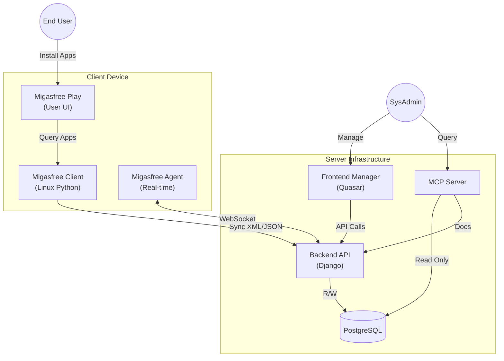

# 🏗️ Migasfree Ecosystem Architecture

This document provides a high-level overview of the **Migasfree** architecture, illustrating how its various components interact to provide a complete systems management solution.

## 🌟 System Overview

Migasfree is designed as a client-server architecture where a central server infrastructure manages a fleet of distributed devices (clients). The system is composed of three main layers:

1. **Server Infrastructure (The Core)**
2. **Client Ecosystem (The Fleet)**
3. **Tools & Utilities**

---

## 1. ☁️ Server Infrastructure (Docker Swarm)

The server side is typically deployed as a **Docker Swarm** stack (`migasfree-swarm`), ensuring high availability and scalability.

### 🔹 Core Components

* **Migasfree Backend (`migasfree-backend`)**:
  * **Technology**: Python / Django.
  * **Role**: The brain of the operation. It exposes a **REST API** referenced in `api_core.md`.
  * **Responsibilities**: Handles business logic, database transactions, inventory processing, and policy management.

* **Migasfree Frontend (`migasfree-frontend`)**:
  * **Technology**: Vue.js / Quasar Framework.
  * **Role**: The administrative dashboard.
  * **Responsibilities**: Provides a modern web interface for system administrators to manage computers, software deployment, and users.

* **Database**:
  * **Technology**: PostgreSQL.
  * **Role**: Persistent storage.
  * **Responsibilities**: Stores all data regarding software, hardware inventory, history, and configurations. Defined in `db_schema.md`.

* **MCP Server (Model Context Protocol)**:
  * **Role**: AI Gateway.
  * **Responsibilities**: Allows AI agents (like Antigravity) to query the database and read documentation context-awarely.

---

## 2. 💻 Client Ecosystem

The managed devices run specific software to communicate with the server.

### 🔹 Agents & Clients

* **Migasfree Client (`migasfree-client`)**:
  * **Target**: GNU/Linux.
  * **Type**: Periodic / Traditional.
  * **Function**: Pull-based agent. It wakes up (scheduled or manual), queries the server for "policies" (software to install/remove, configurations), executes them, and reports inventory back.

* **Migasfree Agent (`migasfree-agent`)**:
  * **Target**: Cross-Platform (Linux/Windows).
  * **Type**: Real-time / Persistent.
  * **Function**: Maintains a **WebSocket** connection. Enables instant actions (e.g., "lock screen now", "scan now") pushed from the server to the client.

### 🔹 User-Facing Apps

* **Migasfree Play (`migasfree-play`)**:
  * **Role**: Enterprise App Store.
  * **Function**: A desktop application that allows end-users to self-service install approved applications without needing admin rights.

* **Migasfree Connect (`migasfree-connect`)**:
  * **Role**: Remote Support.
  * **Function**: Facilitates secure remote desktop connections to managed devices for troubleshooting.

---

## 3. 🔄 Data Flow & Interaction

## 4. 🧰 Cross-Platform Support Tools

To support non-native environments like Windows, specific tools bridge the gap:

* **Windows Package Tool**: Mimics package management behavior on Windows.
* **LSHW Windows Emulator**: Ports the Linux `lshw` command to Windows (via WMI) so the server receives uniform hardware inventory data regardless of the OS.

---

*This document serves as a high-level architectural guide. For specific API details, refer to `api_core.md` or `api_manager.md`.*
