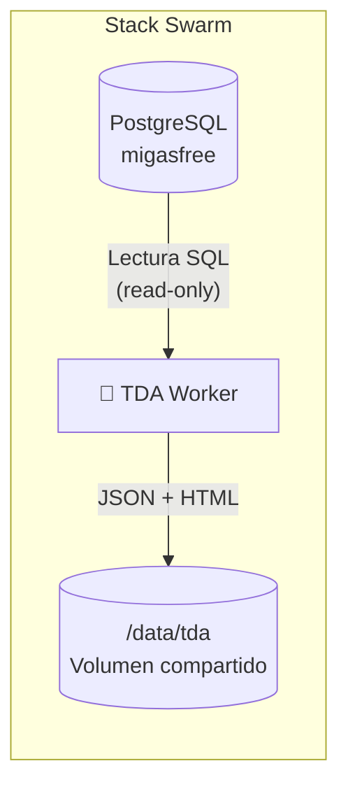
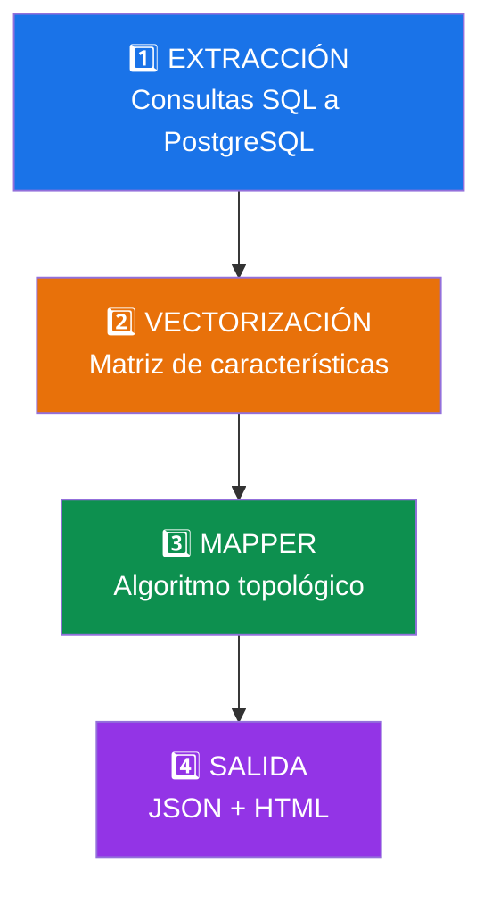
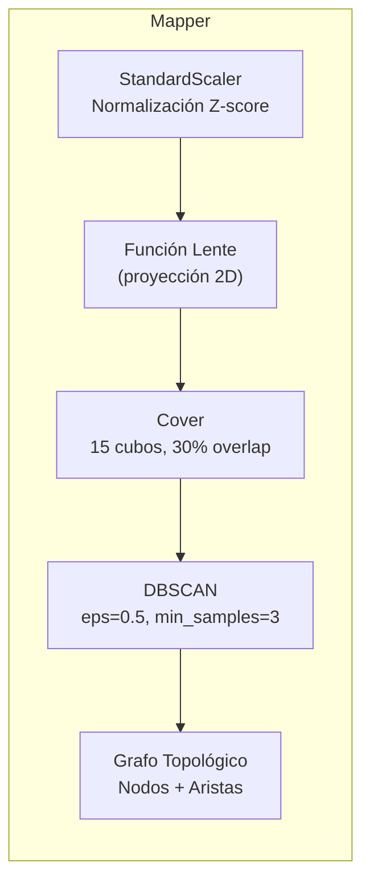
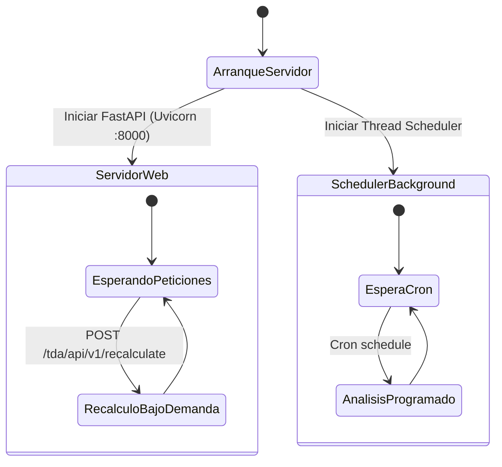
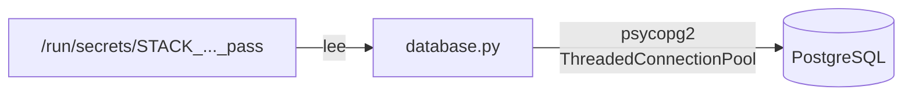
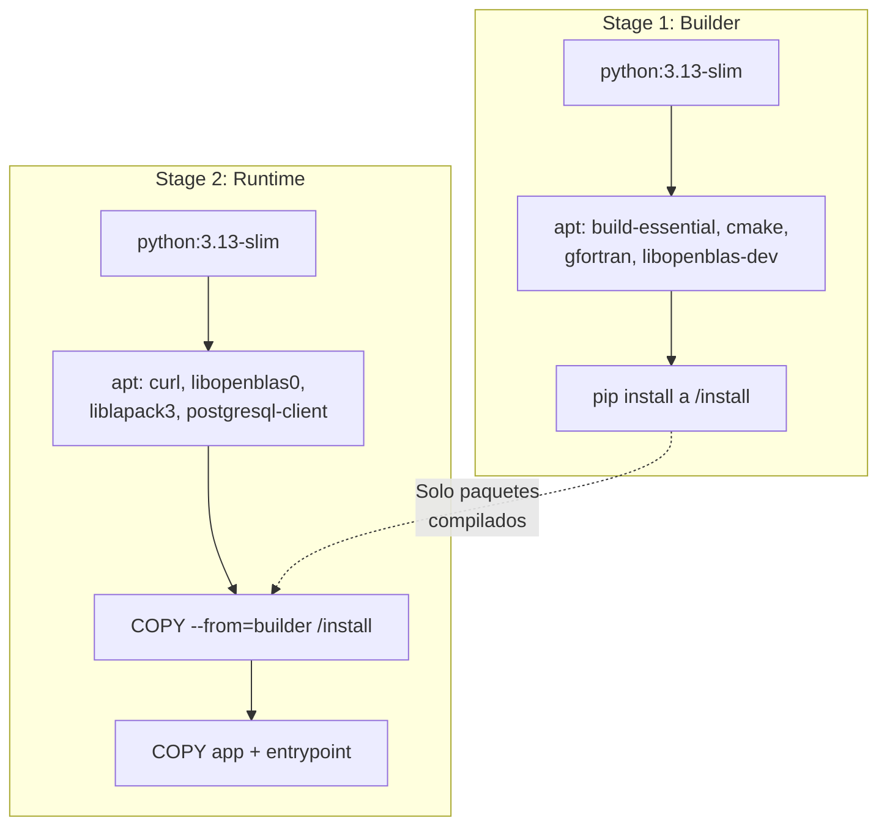

# Servicio TDA para Migasfree — Documentación Técnica

> Guía de arquitectura interna del servicio de **Análisis Topológico de Datos** (TDA) integrado en el stack Docker Swarm de migasfree.

---

## Visión General

El servicio TDA es un **worker analítico asíncrono** que se ejecuta dentro del stack Swarm de migasfree. Su misión es extraer datos del parque informático desde PostgreSQL, construir un espacio de características multidimensional y aplicar el **algoritmo Mapper** (Topological Data Analysis) para generar grafos topológicos que revelan la estructura real de la flota de ordenadores.



El servicio **no modifica** la base de datos. Solo ejecuta consultas `SELECT` de lectura.

---

## Estructura de Ficheros

```
build/tda/
├── Dockerfile                    ← Imagen Docker multi-stage
├── VERSION                       ← Versión del servicio (0.1.0)
├── requirements.txt              ← Dependencias Python
└── defaults/
    ├── docker-entrypoint.sh      ← Punto de entrada del contenedor
    ├── app/
    │   ├── database.py           ← Conexión a PostgreSQL (pool + secrets)
    │   ├── lens_store.py         ← Store de lentes (carpetas en /data/tda/lenses/<name>)
    │   ├── tda_engine.py         ← Motor TDA (extracción + Mapper)
    │   └── tda_worker.py         ← Scheduler del worker
    └── usr/bin/
        └── healthcheck.sh        ← Comprobación de salud
```

---

## Pipeline de Procesamiento

El análisis se ejecuta en 4 fases secuenciales. A continuación se describe cada fase en detalle:



---

### Fase 1: Extracción de Datos

El módulo [`tda_engine.py`](file:///data/git/migasfree-swarm/build/tda/defaults/app/tda_engine.py#L24-L77) define 5 consultas SQL que extraen datos de las últimas **30 días**:

| Consulta | Tablas | Datos extraídos |
| :--- | :--- | :--- |
| `SQL_COMPUTER_ATTRIBUTES` | `client_computer`, `client_computer_sync_attributes`, `client_computer_tags` | ID, nombre, proyecto, estado, IP, array de atributos y tags de cada ordenador |
| `SQL_COMPUTER_ERRORS` | `client_error` | Conteo de errores por ordenador (últimos 30 días) |
| `SQL_COMPUTER_FAULTS` | `client_fault` | Conteo de fallos por ordenador (últimos 30 días) |
| `SQL_COMPUTER_SYNC` | `client_synchronization` | Nº de sincronizaciones, duración media y fallos PMS |
| `SQL_ALL_ATTRIBUTES` | `core_attribute` | Lista completa de IDs de atributos (para codificación binaria) |

> [!NOTE]
> Solo se procesan ordenadores con estado `assigned`, `reserved` o `unknown` (equipos activos en producción).

---

### Fase 2: Vectorización — `build_feature_matrix()`

La función [`build_feature_matrix()`](file:///data/git/migasfree-swarm/build/tda/defaults/app/tda_engine.py#L80-L156) transforma los datos relacionales en una **matriz numérica** donde cada fila es un ordenador y cada columna es una característica:

```
         ┌──── Atributos binarios ────┐ ┌── Métricas ──┐ ┌─ Proyecto ─┐
         │ attr_1  attr_2  ...  attr_N│ │ err  flt  ... │ │ project_id │
PC_001   │   1       0     ...    1   │ │  3    0   ... │ │     2      │
PC_002   │   0       1     ...    0   │ │  0    1   ... │ │     1      │
  ...    │  ...     ...    ...   ...  │ │ ...  ...  ... │ │    ...     │
PC_N     │   1       1     ...    0   │ │  7    2   ... │ │     2      │
         └────────────────────────────┘ └──────────────┘ └────────────┘
```

El proceso paso a paso:

1. **Codificación binaria de atributos**: Cada atributo del catálogo (`core_attribute`) se convierte en una columna 0/1. Si el ordenador tiene ese atributo o tag, vale 1.

2. **Métricas operativas**: Se añaden 5 columnas numéricas:
   - `error_count` — errores en 30 días
   - `fault_count` — fallos en 30 días
   - `sync_count` — sincronizaciones realizadas
   - `avg_sync_duration_secs` — duración media de sincronización
   - `pms_failures` — fallos del gestor de paquetes

3. **Codificación del proyecto**: `project_id` se transforma a un valor numérico con `LabelEncoder`.

4. **Limpieza**: Se eliminan columnas con **varianza cero** (atributos que nadie tiene o que todos tienen) para reducir el ruido.

> [!TIP]
> Para un parque de 5.000 ordenadores con 500 atributos, la matriz resultante sería aproximadamente `5.000 × 350` (tras eliminar columnas sin varianza), lo que ocupa ~7 MB en memoria.

---

### Fase 3: Algoritmo Mapper — `run_mapper()`

La función [`run_mapper()`](file:///data/git/migasfree-swarm/build/tda/defaults/app/tda_engine.py#L159-L233) implementa el corazón del análisis topológico. El algoritmo **Mapper** funciona en 3 pasos internos:



#### 3.1 Normalización

Todas las columnas se normalizan con **StandardScaler** (media=0, desviación=1) para que atributos binarios y métricas numéricas tengan el mismo peso.

#### 3.2 Función Lente

La **lente** (función filtro $f: X \to \mathbb{R}^d$) es la proyección matemática que "ilumina" la nube de puntos multidimensional desde un ángulo específico. Al cambiar la lente, el motor TDA preserva las mismas máquinas pero las agrupa bajo criterios operativos radicalmente distintos.

### 3.2.1 Lentes declarativas definidas por el usuario

Las lentes **ya no están hardcodeadas**: cada lente es una **carpeta autocontenida** en `/data/tda/lenses/<name>/` (módulo `lens_store.py`) que agrupa su descriptor, su grafo JSON y su visualización HTML:

```
/data/tda/lenses/<name>/
    config.json     ← descriptor de la lente (configuración)
    mapper.json     ← grafo Mapper generado (JSON)
    mapper.html     ← visualización KeplerMapper (diagnóstico)
```

El servicio incluye **6 lentes integradas** que se siembran automáticamente en el primer arranque (no se pueden borrar ni renombrar) y admite **lentes personalizadas** creadas desde `/tda/settings` o vía API.

| Campo | Tipo | Descripción |
|---|---|---|
| `name` | `string` | Slug único `^[a-z0-9][a-z0-9_-]{1,63}$` (inmutable) |
| `label` | `string` | Nombre visible en el dashboard |
| `description` | `string` | Explicación mostrada junto al botón de la lente |
| `projection` | `string` | `pca` \| `metric_pair` \| `single_metric` \| `mds_jaccard` |
| `metric_columns` | `string[]` | Columnas numéricas usadas por la proyección (2 para `metric_pair`, 1 para `single_metric`) |
| `matrix_source` | `string` | Solo `mds_jaccard`: `attributes` (divergencia de configuración) o `packages` (deriva de software) |
| `color` | `object` | Métrica con la que se colorean los nodos del Mapper: `{ columns, label, kind }` con `kind` = `continuous` \| `categorical` |
| `node_label` | `string` | Texto bajo cada nodo: `attribute` (atributo más distintivo, *motivo de agrupación*) o `metric` (valor de la métrica de color, p. ej. `48.2 GB` de RAM) |
| `formula_prefix_ids` | `int[]` | Tipos de atributo (`core_property`) incluidos en la matriz TDA de esta lente. **Vacío = sin dimensiones de atributos** (solo métricas, hardware, paquetes y proyecto) |
| `scope_ids` | `int[]` | Restringe el análisis a los ordenadores de estos **scopes** de migasfree (unión de scopes, vacío = sin filtro de scope) |
| `builtin` | `boolean` | `true` para las 6 lentes integradas (no borrables) |

```json
{
  "name": "disk_health",
  "label": "Disk Health",
  "description": "Group computers by disk capacity and error rate",
  "projection": "metric_pair",
  "metric_columns": ["disk_gb", "error_count"],
  "matrix_source": null,
  "color": {
    "columns": ["disk_gb"],
    "label": "Disk (GB)",
    "kind": "continuous"
  },
  "node_label": "metric",
  "formula_prefix_ids": [3, 5],
  "scope_ids": [],
  "builtin": false
}
```

> [!NOTE]
> El `color`, `formula_prefix_ids` y `scope_ids` son **por lente**: cada lente construye su propia matriz de características con sus filtros y colorea sus nodos con su métrica. Las lentes integradas se siembran heredando los valores del antiguo `config.json` global (migración automática en el primer arranque).

Los **scopes** son filtros por atributos definidos en migasfree (`core_scope`): un ordenador pertenece a un scope si tiene **al menos un** `included_attribute` y **ningún** `excluded_attribute`, opcionalmente acotado por un `domain`. En el selector de Settings solo aparecen los scopes del **usuario autenticado** (su `user_id`). Varios scopes seleccionados = **unión**.

**Estrategias de proyección** (implementadas en `tda_engine.apply_lens_projection()`):

- `pca` — PCA sobre todo el espacio de características normalizado (como `obsolescence`).
- `metric_pair` — dos métricas numéricas estandarizadas como ejes X/Y (como `health`, `sync`, `migration`).
- `single_metric` — una métrica como eje X (eje Y = 0).
- `mds_jaccard` — distancia de **Jaccard** sobre la matriz binaria de atributos o paquetes + **MDS** (como `diversity`/`software`).

Toda proyección cae a PCA cuando los datos solicitados no tienen varianza. Las lentes integradas se definen con este mismo esquema:

| Lente | Proyección | Columnas / fuente |
|---|---|---|
| `health` | `metric_pair` | `error_count`, `fault_count` |
| `obsolescence` | `pca` | — |
| `software` | `mds_jaccard` | fuente `packages` |
| `migration` | `metric_pair` | `migration_count`, `days_since_last_migration` |
| `sync` | `metric_pair` | `avg_sync_duration_secs`, `pms_failures` |
| `diversity` | `mds_jaccard` | fuente `attributes` |

**Selección de lentes en la ejecución programada** (`tda_worker.get_lens_specs_for_run()`):

- Las lentes **personalizadas siempre se ejecutan**.
- Las lentes integradas se ejecutan salvo que `TDA_LENSES` las restrinja explícitamente (comportamiento heredado).
- Con `TDA_LENSES` vacío/sin definir se ejecutan las 6 integradas + todas las personalizadas.
- Una lente concreta se puede recalcular al momento desde Settings (`POST /api/v1/lenses/{name}/recalculate`) aunque no esté en la ejecución programada.

---

##### 🩺 1. Lente `health` (Salud y Fallos Operacionales)

- **Origen de Datos (Tablas y Columnas)**:
  - `client_error`: Conteo de registros por `computer_id` en los últimos 30 días (`COUNT(*)`).
  - `client_fault`: Conteo de fallos de diagnóstico en los últimos 30 días (`COUNT(*)`).
- **Lo que revela**:
  - Concentración de fallos y severidad de errores en subgrupos de la flota.
  - Separación entre máquinas estables (sin incidencias) y equipos con fallos recurrentes o críticos.
- **Cómo interpretarla**:
  - **Ejes y Posición**: La lente proyecta los equipos en un plano 2D según sus tasas de `error_count` y `fault_count`.
  - **Color y Nodos**: Los nodos verdes agrupan ordenadores estables. A medida que un cluster se desplaza hacia valores altos de fallos/errores, vira hacia ámbar y rojo.
  - **Clusters Problemáticos**: Nodos rojos identifican conjuntos de máquinas que están experimentando niveles de error anómalos de forma simultánea.
- **Utilidad Práctica**:
  - **SRE / Soporte Técnico**: Priorizar intervenciones de mantenimiento en los clusters de mayor tasa de error antes de que los usuarios reporten las incidencias.

---

##### ⚙️ 2. Lente `obsolescence` (Familias y Capacidad de Hardware)

- **Origen de Datos (Tablas y Columnas)**:
  - `client_computer`:
    - `ram`: Memoria RAM total en bytes (convertida a `ram_gb`).
    - `storage`: Capacidad de almacenamiento en bytes (convertida a `disk_gb`).
  - `hardware_node`:
    - `product`, `capacity`, `clock` (donde `class_name = 'processor'`): Modelo y frecuencia de reloj de la CPU.
    - `product` (donde `class_name = 'display'`): Controladores gráficos y GPUs dedicadas/integradas.
    - `product` (donde `class_name = 'network'`): Adaptadores de red física y Wi-Fi.
  - **Algoritmo de Proyección**: **PCA 2D** sobre las componentes principales de varianza del espacio físico normalizado.
- **Lo que revela**:
  - Distribución del parque según potencia física real y familias de arquitectura.
  - Brechas de capacidad técnica entre diferentes generaciones de puestos de trabajo.
- **Cómo interpretarla**:
  - **Distribución Espacial**: Los clusters en un extremo del grafo agrupan las estaciones de alto rendimiento (ej. 32–64 GB RAM, GPUs dedicadas, procesadores multi-núcleo). En el extremo opuesto o en ramas divergentes se sitúan las máquinas de recursos limitados (ej. 4 GB RAM, discos pequeños).
  - **Nodos Aislados**: Equipos singulares con configuraciones físicas anómalas (*hardware unicorns*).
- **Utilidad Práctica**:
  - **Planificación de Compras / Presupuestos**: Saber con precisión qué porcentaje de la flota requiere ampliación de RAM o renovación antes de adoptar nuevos sistemas operativos.
  - **Validación de Despliegues Pesados**: Comprobar visualmente si los equipos objetivo de una aplicación exigente pertenecen a clusters con capacidad suficiente.

---

##### 📦 3. Lente `software` (Inventario y Deriva de Paquetes)

- **Origen de Datos (Tablas y Columnas)**:
  - `client_packagehistory`: Registro histórico de instalaciones (`computer_id`, `package_id`) filtrando paquetes activos con `uninstall_date IS NULL`.
  - `core_package`: Catálogo de paquetes (`id`, `name`, `version`, `architecture`).
  - **Algoritmo de Proyección**: **Distancia de Jaccard** sobre la matriz binaria de presencia de paquetes + **MDS / PCA**.
- **Lo que revela**:
  - **Arquetipos de Software**: Puestos que comparten exactamente el mismo ecosistema de aplicaciones (ofimática, desarrollo, aulas, diseño).
  - **Deriva de Software (*Software Drift*)**: Equipos que se desvían del estándar corporativo debido a instalaciones locales, paquetes residuales o modificaciones no autorizadas (*Shadow IT*).
- **Cómo interpretarla**:
  - **Núcleo Central**: Representa la "imagen base" o estándar oficial del proyecto migasfree.
  - **Ramificaciones (*Flares / Tendrils*)**: Grupos de máquinas que se alejan progresivamente del núcleo a medida que incorporan software adicional o diferente.
  - **Nodos Desconectados**: Equipos con una pila de software completamente dispar al resto de su proyecto.
- **Utilidad Práctica**:
  - **Auditoría de Seguridad y Cumplimiento**: Detectar de un vistazo máquinas con paquetes ajenos a las políticas del proyecto o instalaciones locales no autorizadas.
  - **Optimización de Despliegues**: Identificar software común que los usuarios hayan instalado de forma independiente para incorporarlo formalmente al catálogo del proyecto en migasfree.

---

##### 🚀 4. Lente `migration` (Trayectorias y Frentes de Migración)

- **Origen de Datos (Tablas y Columnas)**:
  - `client_migration`: Historial de eventos de migración de proyectos (`computer_id`, `project_id`, `created_at`).
  - `client_computer`: Proyecto actual vs. proyecto histórico (`project_id`).
  - **Métricas temporales**: `days_since_last_migration` (días transcurridos desde el último cambio de proyecto) y `migration_count` (número total de migraciones experimentadas).
  - **Algoritmo de Proyección**: Espacio 2D sobre la tasa de migración y la ventana temporal de adopción.
- **Lo que revela**:
  - **Frentes de Migración**: Velocidad de avance y estado de transición de la flota entre versiones de SO o proyectos corporativos.
  - **Bifurcaciones de Bloqueo**: Subgrupos de equipos que se quedan estancados en versiones previas o sufren regresiones.
- **Cómo interpretarla**:
  - **Nodos y Gradiente**: El cluster con $0$ migraciones representa la base no migrada; los nodos que avanzan por el grafo marcan las distintas olas de migración completadas.
  - **Ramas Separadas**: Si un grupo de equipos migrados diverge hacia valores de error altos, señala problemas de incompatibilidad post-migración específicos de ese cluster.
- **Utilidad Práctica**:
  - **Gestión de Proyectos de Migración Masiva**: Monitorizar en tiempo real el progreso de adopción de una nueva distribución (ej. Debian 11 $\to$ Debian 13) e identificar de forma temprana los cuellos de botella que frenan la migración.

---

##### 🔄 5. Lente `sync` (Rendimiento de Red y Sincronizaciones)

- **Origen de Datos (Tablas y Columnas)**:
  - `client_synchronization`:
    - `start_date`, `created_at`: Duración media en segundos de cada sincronización ($\Delta t$).
    - `pms_status_ok`: Conteo de fallos en la ejecución del Package Management System (`pms_failures`).
    - `COUNT(*)`: Frecuencia de sincronización de los últimos 30 días.
- **Lo que revela**:
  - Cuellos de botella en la entrega de paquetes y repositorios lentos o saturados.
  - Máquinas con bloqueos recurrentes en el gestor de paquetes local (`dpkg`/`apt`/`pacman`).
- **Cómo interpretarla**:
  - **Gradiente de Color / Posición**: Nodos con duraciones de sincronización anormalmente altas (minutos u horas) se desplazan hacia zonas de alerta.
  - **Agrupaciones**: Si todo un departamento o subred aparece en un cluster de sincronización lenta, el problema apunta al enlace de red o proxy de sede, no a los puestos individuales.
- **Utilidad Práctica**:
  - **Optimización de Infraestructura**: Detectar sedes remotas con enlaces saturados o necesidad de repositorios locales/caché.

---

##### 🌐 6. Lente `diversity` (Divergencia Global de Atributos)

- **Origen de Datos (Tablas y Columnas)**:
  - `client_computer_sync_attributes`: Atributos dinámicos calculados en cliente (`attribute_id`).
  - `client_computer_tags`: Etiquetas del servidor (`serverattribute_id`).
  - `core_attribute`: Catálogo completo de atributos corporativos.
  - **Algoritmo de Proyección**: Matriz de distancias de Jaccard sobre todo el espacio de atributos + **MDS**.
- **Lo que revela**:
  - Heterogeneidad lógica de la organización sin sesgo de categorías predefinidas.
  - Silos organizativos y configuraciones atípicas en fórmulas y etiquetas.
- **Cómo interpretarla**:
  - **Distancia en el Plano**: Equipos con combinaciones de etiquetas idénticas colapsan en el mismo nodo; configuraciones singulares se proyectan en la periferia.
- **Utilidad Práctica**:
  - **Gobierno de Políticas**: Evaluar la complejidad de las reglas de etiquetado y simplificar asignaciones redundantes en migasfree.

---

> [!TIP]
>
> ### 📐 Fundamentos Matemáticos de las Proyecciones
>
> #### 1. Distancia de Jaccard (Software y Atributos)
>
> Para comparar matrices esparsas binarias (paquetes o atributos) se descarta la distancia euclídea para evitar el **sesgo de ceros compartidos** (asumir que dos ordenadores son iguales solo porque a ambos les faltan los mismos miles de paquetes que no tienen instalados).
>
> $$\text{Similitud de Jaccard: } J(A, B) = \frac{|A \cap B|}{|A \cup B|}, \qquad \text{Distancia: } d_J(A, B) = 1 - J(A, B)$$
>
> #### 2. Multidimensional Scaling (MDS)
>
> Convierte la matriz de distancias no euclídeas $N \times N$ de Jaccard en un espacio métrico continuo 2D preservando las relaciones de proximidad global para que el algoritmo Mapper pueda aplicar la cobertura de cubos solapados.
>
> #### 3. PCA (Análisis de Componentes Principales)
>
> Proyecta variables cuantitativas continuas ($\text{RAM}$, $\text{Disco}$, $\text{CPU MHz}$) a lo largo de los ejes de máxima variabilidad estadística, separando naturalmente los estratos de potencia técnica.

#### 3.3 Cobertura y Clustering

El espacio proyectado por la lente se divide en **15 cubos solapados al 30%** (`km.Cover`). En cada cubo, **DBSCAN** agrupa los ordenadores cercanos. El solapamiento es clave: permite que un mismo ordenador aparezca en varios nodos del grafo, generando las **aristas** que conectan los clusters.

```
    Espacio de la lente (2D)
    ┌─────────┬─────────┬─────────┐
    │  Cubo 1 │  Cubo 2 │  Cubo 3 │   Cada cubo contiene los PCs
    │ ●●●     │   ●●●●  │     ●●  │   que caen en esa región.
    ├───┤ ├───┼───┤ ├───┼───┤ ├───┤
    │  Cubo 4 │  Cubo 5 │  Cubo 6 │   En cada cubo, DBSCAN
    │    ●    │  ●●●●●  │   ●●●   │   crea micro-clusters.
    ├───┤ ├───┼───┤ ├───┼───┤ ├───┤
    │  Cubo 7 │  Cubo 8 │  Cubo 9 │   PCs en la zona de
    │  ●●     │  ●●●    │    ●    │   solapamiento ┤ ├ conectan
    └─────────┴─────────┴─────────┘   los nodos entre sí.
```

#### 3.4 Grafo resultante

El resultado es un **grafo topológico** donde:

- **Nodo** = un micro-cluster de ordenadores similares
- **Arista** = los clusters comparten al menos un ordenador (estaban en cubos solapados)
- **Tamaño del nodo** = número de ordenadores en ese cluster
- **Metadata del nodo** = proyectos, estados, media de errores/fallos/sincronización

---

### Fase 4: Salida

Para cada lente, se generan **dos ficheros** dentro de su carpeta `/data/tda/lenses/<name>/`:

| Fichero | Formato | Uso |
| :--- | :--- | :--- |
| `mapper.json` | JSON estructurado | Consumo programático (API, frontend, dashboards). Se sobrescribe en cada ejecución. |
| `mapper.html` | HTML interactivo (KeplerMapper) | Visualización directa en navegador. Se sobrescribe en cada ejecución. |

> [!NOTE]
> Al arrancar, el servicio **migra automáticamente** los ficheros legacy `/data/tda/mapper_<name>.{json,html}` (layout anterior) a las carpetas de su lente. Los endpoints siguen leyendo ambos layouts por compatibilidad.

#### Estructura del JSON

```json
{
  "metadata": {
    "lens": "health",
    "generated_at": "2026-08-24T01:00:00",
    "total_computers": 5000,
    "total_nodes": 42,
    "total_edges": 67
  },
  "nodes": [
    {
      "id": 0,
      "size": 120,
      "computer_ids": [1, 5, 23],
      "projects": [{"id": 2, "name": "AZL-20", "count": 80}],
      "statuses": {"assigned": 100, "reserved": 20},
      "avg_errors": 0.3,
      "avg_faults": 0.1,
      "avg_sync_duration": 45.2,
      "color_value": 0.4,
      "top_attributes": [
        {"name": "CTX-School", "count": 118, "pct": 98.3, "lift": 6.2},
        {"name": "PRJ-AZL-20", "count": 80, "pct": 66.7, "lift": 4.1}
      ]
    }
  ],
  "edges": [
    {"source": 0, "target": 1, "shared_count": 3, "shared_computer_ids": [5, 23, 41], "shared_computer_names": ["pc-5", "pc-23", "pc-41"]},
    {"source": 1, "target": 3, "shared_count": 0, "shared_computer_ids": [], "shared_computer_names": []}
  ]
}
```

---

## Integración con el Manager y el Dashboard

Las lentes analíticas de TDA se exponen y visualizan a través del servicio `manager` utilizando los siguientes mecanismos:

### Endpoints de API (`routers/tda.py`)

- `/api/v1/private/tda/lenses`: Obtiene la lista de lentes generadas disponibles.
- `/api/v1/private/tda/lens/{lens_name}/json`: Devuelve el JSON con la estructura topológica (consumido por el dashboard).
- `/api/v1/private/tda/lens/{lens_name}/html`: Devuelve la visualización HTML de KeplerMapper (mantenido para acceso directo / diagnóstico).

### Endpoints de lentes declarativas (servicio `tda`)

| Método | Endpoint | Descripción |
|---|---|---|
| `GET` | `/api/v1/lenses` | Nombres de lentes con grafo generado (compatibilidad) |
| `GET` | `/api/v1/lenses/details` | Descriptores de todas las lentes (integradas + personalizadas) con estado de generación |
| `GET` | `/api/v1/lenses/{name}` | Descriptor de una lente |
| `POST` | `/api/v1/lenses` | Crear una lente personalizada |
| `PUT` | `/api/v1/lenses/{name}` | Editar una lente (el nombre de las integradas es inmutable) |
| `DELETE` | `/api/v1/lenses/{name}` | Borrar una lente personalizada y sus resultados |
| `POST` | `/api/v1/lenses/{name}/recalculate` | Recalcular una única lente en background |
| `GET` | `/api/v1/config/available-metric-columns` | Columnas numéricas disponibles como métricas de proyección |
| `GET` | `/api/v1/config/available-prefixes` | Tipos de atributo (`core_property`) disponibles para el filtro de dimensiones |
| `GET` | `/api/v1/config/available-scopes` | Scopes del usuario autenticado con nº de ordenadores |

### Visualización 3D con 3d-force-graph

El dashboard principal (`tda.html`) consume el endpoint **JSON** y renderiza el grafo topológico tridimensional interactivo mediante **3d-force-graph**:

```
GET /tda/api/v1/lens/{lens}/json
           │
           ▼
   tda.html (3d-force-graph / WebGL)
   ┌──────────────────────────────────────┐
   │  Sidebar          3D Sphere Canvas   │  Detail Panel
   │  ─────────        ────────────────   │  ────────────
   │  • Lens list      • Nodos 3D         │  • Métricas
   │  • Graph stats      escalados        │  • Proyectos
   │  • Controls       • Color: score/    │  • Estados
   │  • Color legend     métrica continua │  • Lista PCs
   │                   • Force simulation │  • Links →
   │                     3D / WebGL       │    migasfree
   └──────────────────────────────────────┘
```

- **Asset local**: `3d-force-graph.min.js` se sirve localmente desde `/tda/static/js/3d-force-graph.min.js` para garantizar el funcionamiento en entornos sin acceso a Internet.
- **Color semántico**: Los nodos se colorean con una escala verde → ámbar → rojo según la métrica de la lente activa (errores+fallos en `health`, duración de sync en `sync`).
- **Panel lateral deslizante**: Al hacer clic en cualquier nodo se abre un panel con las métricas del cluster. Se muestran únicamente las métricas incluidas en la matriz de datos de la lente (`dataset.metric_columns`), junto con las columnas de color de la lente activa. Cada métrica se renderiza como una tarjeta dinámica (p. ej. `Avg RAM`, `Avg Errors`…). Una tarjeta de **Computers** (nº de equipos en el nodo) aparece siempre. El panel también muestra el **motivo de agrupación** (atributos más compartidos/característicos del nodo, con su prevalencia y *lift* respecto a la flota), distribución por proyecto/estado y lista de `computer_ids` con enlaces directos a `https://<FQDN>/computers/results/<computer_id>`.
- **Texto distintivo sobre los nodos**: el atributo más distintivo de cada nodo se dibuja bajo el nodo en una capa DOM por encima del canvas (siempre en primer plano, con tamaño de letra proporcional al tamaño del nodo) y se puede mostrar/ocultar con el checkbox **Text** de la barra de controles.
- **Aristas explicadas**: al hacer clic en una arista se muestran los ordenadores compartidos entre los dos nodos (motivo de la arista en el Mapper).
- **Resaltado de vecindad**: Al seleccionar un nodo, los nodos y aristas no conectados se atenúan visualmente para facilitar la lectura del grafo.

### Tarjeta de Servicio en la Home

- El TDA se integra en el panel principal (`status.html`) como una **Service Card** (tarjeta de servicio) dedicada en la cuadrícula general.
- Dispone de un indicador luminoso (círculo verde) que refleja el estado de salud del contenedor y redirige directamente a la visualización de TDA Lenses en una pestaña nueva al hacer clic.

---

## El Worker — Ciclo de Vida

El servicio [`tda`](file:///data/git/migasfree-swarm/build/tda/defaults/app/main.py) funciona como un **microservicio web autónomo** (FastAPI + Uvicorn) que combina:

1. **Servidor Web y API REST** en el puerto `8000`: Sirve el dashboard interactivo (`/tda/dashboard`), endpoints de grafos (`/tda/api/v1/lens/{name}/json`) y el endpoint de recálculo bajo demanda (`POST /tda/api/v1/recalculate`).
2. **Scheduler en Background** ([`tda_worker.py`](file:///data/git/migasfree-swarm/build/tda/defaults/app/tda_worker.py)): Ejecuta análisis periódicos programados y gestiona el bloqueo de ejecución concurrente.



| `TDA_SCHEDULE` | `0 3 * * *` | Hora de ejecución (por defecto 03:00 cada noche) |
| `TDA_LENSES` | `health,obsolescence,sync,diversity` | Filtro opcional de las lentes **integradas** a ejecutar (las personalizadas se ejecutan siempre) |

### Configuración dinámica (`/data/tda/config.json`)

> [!IMPORTANT]
> Desde la versión de **lentes declarativas**, la configuración de coloreado, atributos y scopes es **por lente** y se guarda en cada `lenses/<name>/config.json` desde la página `/tda/settings` (directamente en el editor del mapa seleccionado). El fichero `/data/tda/config.json` solo se mantiene para **retrocompatibilidad**: sus valores se heredan al sembrar/migrar las lentes integradas en el primer arranque y actúan como *fallback* si una lente no define sus propios valores.

| Clave | Formato | Descripción |
|---|---|---|
| `formula_prefix_ids` | `[3, 5]` | Prefijos por defecto heredados por las lentes integradas |
| `lens_colors` | `{ "<lens>": { "columns": [...], "label": "...", "kind": "..." } }` | Colores por defecto heredados por las lentes integradas. `columns` admite varias columnas (se suman); `kind` es `continuous` (gradiente verde→ámbar→rojo) o `categorical` (color distinto por categoría, p. ej. proyecto) |

Ejemplo:

```json
{
  "formula_prefix_ids": [3, 5],
  "lens_colors": {
    "health":   { "columns": ["error_count"], "label": "Error Count", "kind": "continuous" },
    "sync":     { "columns": ["avg_sync_duration_secs"], "label": "Avg Sync Duration (secs)", "kind": "continuous" },
    "software": { "columns": ["total_packages"], "label": "Total Installed Packages", "kind": "continuous" },
    "diversity": { "columns": ["project_encoded"], "label": "Project", "kind": "categorical" }
  }
}
```

En el motor, el color de cada lente se resuelve con esta prioridad: **`color` del descriptor de la lente** → `lens_colors` del `config.json` global → métrica propia por defecto / `project_encoded`. Cada lente construye su propia matriz con sus `formula_prefix_ids` y `scope_ids`.

> [!NOTE]
> El worker duerme en intervalos de 30 segundos para permitir un **shutdown graceful** ante señales SIGTERM/SIGINT.

---

## Conexión a la Base de Datos

El módulo [`database.py`](file:///data/git/migasfree-swarm/build/tda/defaults/app/database.py) sigue el **mismo patrón** que el servicio [MCP server](file:///data/git/migasfree-swarm/build/mcp-server/defaults/app/database.py):



- La contraseña **nunca** se escribe en variables de entorno ni en código: se lee del fichero montado por Docker Secrets en `/run/secrets/`.
- El pool mantiene entre 1 y 5 conexiones, con **detección automática de conexiones muertas** (rollback + `SELECT 1` de prueba).
- La función `query_dataframe()` devuelve directamente un `pandas.DataFrame`, ideal para alimentar el pipeline numérico.

---

## Dockerfile — Build Multi-Stage

El [Dockerfile](file:///data/git/migasfree-swarm/build/tda/Dockerfile) usa **dos etapas** para minimizar el tamaño de la imagen final:



> [!IMPORTANT]
> Las herramientas de compilación (gcc, cmake, gfortran, headers) solo existen en la etapa `builder` y **no se incluyen** en la imagen final. Esto reduce el tamaño de ~1.5 GB a ~500 MB aproximadamente.

---

## Interpretación de los Resultados

### ¿Qué significan los nodos del grafo?

Cada **nodo** representa un grupo de ordenadores que son topológicamente similares (comparten atributos, perfiles de error, tiempos de sincronización, etc.). A diferencia de un clustering clásico (K-Means), Mapper preserva las **transiciones suaves** entre grupos.

### ¿Qué significan las aristas?

Una **arista** entre dos nodos indica que comparten ordenadores en común. Esto significa que hay una **transición gradual** entre ambos perfiles — no es un corte abrupto.

### Patrones a buscar

| Patrón en el Grafo | Significado | Acción |
| :--- | :--- | :--- |
| **Nodo grande y central** | Cluster principal — la "normalidad" del parque | Línea base de referencia |
| **Ramificación (tendril)** | Subgrupo que diverge del estándar (*configuration drift*) | Investigar qué atributos/paquetes difieren |
| **Nodo aislado** | Anomalía — equipo(s) muy diferentes al resto | Posible equipo mal configurado o comprometido |
| **Bucle (ciclo)** | Dependencia circular o estado oscilante | Revisar políticas de despliegue que puedan entrar en conflicto |
| **Nodo con alta media de errores** | Combinación HW/SW problemática | Correlacionar con los `computer_ids` del nodo para identificar el patrón |

---

## Cómo Construir y Ejecutar

### Build

```bash
cd /data/git/migasfree-swarm/build
./build.sh tda
```

### Ejecución manual (para pruebas)

```bash
docker run --rm \
  -e POSTGRES_HOST=<ip_database> \
  -e POSTGRES_USER=migasfree \
  -e POSTGRES_PASSWORD_FILE=/run/secrets/pass \
  -v /path/to/secret:/run/secrets/pass:ro \
  -v /tmp/tda-output:/data/tda \
  migasfree/tda:latest
```

### Integración en el Stack Swarm

Para añadir el servicio TDA al stack, se necesitaría una sección en el template de stack similar a:

```yaml
tda:
    image: migasfree/tda:{{TAG}}
    environment:
        - TZ={{TZ}}
        - FQDN={{FQDN}}
        - STACK={{STACK}}
        - SERVICE={{SERVICE}}
        - POSTGRES_USER={{MCP_RO_USER | default('mcp_ro')}}
        - POSTGRES_PASSWORD_FILE=/run/secrets/{{STACK}}_mcp_ro_pass
        - POSTGRES_HOST={{POSTGRES_HOST}}
        - POSTGRES_PORT={{POSTGRES_PORT}}
        - POSTGRES_DB={{POSTGRES_DB}}
        - TDA_SCHEDULE=0 3 * * *
        - TDA_LENSES=health,obsolescence,sync,diversity
    secrets:
        - source: {{STACK}}_mcp_ro_pass
    deploy:
        replicas: 1
        resources:
            limits:
                memory: 4G
                cpus: '2'
    volumes:
        - tda_data:/data/tda
```

> [!WARNING]
> Se recomienda usar un usuario de base de datos **read-only** (como `mcp_ro`) para garantizar que el servicio TDA no pueda modificar datos accidentalmente.
