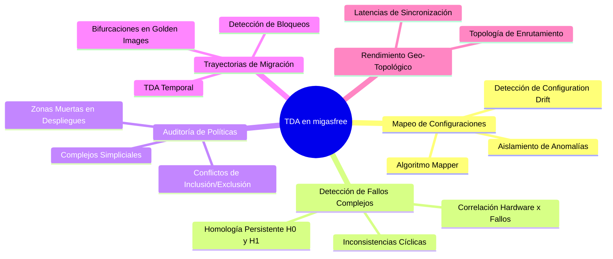
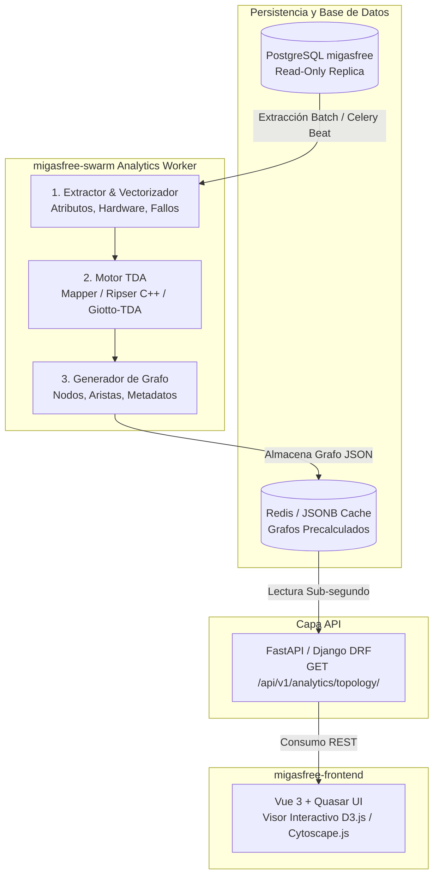

# Análisis Topológico de Datos (TDA) en migasfree

> **Estudio de Viabilidad y Arquitectura Técnica**  
> Exploración del Análisis Topológico de Datos (*Topological Data Analysis - TDA*) aplicado a la gestión, diagnóstico y optimización de parques informáticos heterogéneos en migasfree.

---

## Tabla de Contenidos

1. [Introducción y Justificación](#1-introducción-y-justificación)
2. [Dimensiones Clave en el Esquema de migasfree](#2-dimensiones-clave-en-el-esquema-de-migasfree)
3. [Casos de Uso Principales](#3-casos-de-uso-principales)
   - [A. Mapeo de Configuraciones y Deriva (*Mapper Algorithm*)](#a-mapeo-de-configuraciones-y-deriva-del-parque-mapper-algorithm)
   - [B. Detección de Fallos Combinatorios Complejos ($H_0, H_1$)](#b-detección-de-fallos-combinatorios-complejos-homología-persistente-h_0-h_1)
   - [C. Agujeros de Cobertura en Políticas y Despliegues](#c-agujeros-de-cobertura-en-políticas-y-despliegues-complejos-simpliciales)
   - [D. Trayectorias de Migración y Cuellos de Botella Temporales](#d-trayectorias-de-migración-y-cuellos-de-botella-tda-temporal)
   - [E. Correlación Geo-Topológica del Rendimiento](#e-correlación-geo-topológica-del-rendimiento-de-red)
4. [Propuesta de Arquitectura e Integración en el Stack](#4-propuesta-de-arquitectura-e-integración-en-el-stack)
5. [Consumo de Recursos y Estrategias de Optimización](#5-consumo-de-recursos-y-estrategias-de-optimización)
6. [Motor Generalista y Visión Multifiltro (*Lentes TDA*)](#6-motor-generalista-y-visión-multifiltro-lentes-tda)
7. [Conclusiones](#7-conclusiones)

---

## 1. Introducción y Justificación

El **Análisis Topológico de Datos (TDA)** es una disciplina de la ciencia de datos y la geometría computacional que extrae la **forma intrínseca** (clusters, ramificaciones, bucles y cavidades) de conjuntos de datos complejos y de alta dimensionalidad.

> [!TIP]
> **¿Por qué TDA frente a la estadística tradicional?**  
> Métodos clásicos como *K-Means* asumen nubes de puntos esféricas y *PCA* fuerza proyecciones lineales que ocultan relaciones combinatorias finas. TDA preserva tanto la **estructura global** como las **microestructuras locales**, siendo inmune a transformaciones continuas y rotaciones en el espacio métrico.

Debido a la naturaleza heterogénea, no lineal y altamente relacional de los parques gestionados por migasfree (hardware variado, versiones de paquetes, etiquetas dinámicas y políticas jerárquicas), TDA resulta idóneo para generar un **"mapa genómico"** de la flota de ordenadores.

---

## 2. Dimensiones Clave en el Esquema de migasfree

Al examinar el esquema relacional de migasfree, destacan cinco fuentes de datos ricas en propiedades geométricas y métricas:

| Dominio | Tablas Relevantes | Naturaleza de los Datos |
| :--- | :--- | :--- |
| **Atributos y Etiquetas** | `core_attribute`<br>`client_computer_sync_attributes`<br>`client_computer_tags` | Vectores binarios y categóricos de alta dimensionalidad derivados de fórmulas ejecutadas en cliente (departamento, ubicación, perfil de usuario). |
| **Jerarquía de Hardware** | `hardware_node`<br>`hardware_configuration`<br>`hardware_capability` | Árboles jerárquicos de componentes procedentes de `lshw` (familias de CPU, chipsets de red, GPUs, topología de memoria RAM, buses y slots PCI). |
| **Software y Despliegues** | `core_deployment`<br>`core_package`<br>`client_packagehistory`<br>`app_catalog_*` | Conjuntos de paquetes instalados, versiones activas, dependencias y reglas de asignación por proyecto. |
| **Diagnósticos y Fallos** | `client_fault`<br>`client_error`<br>`client_synchronization`<br>`client_faultdefinition` | Series temporales de eventos de sincronización (`sync_start_date`, `sync_end_date`), estado del PMS (`pms_status_ok`) y catálogo de diagnósticos. |
| **Ciclo de Vida e Imágenes** | `mgi_*`<br>`client_migration`<br>`client_statuslog` | Versiones de *Golden Images* (MGI), transiciones de estado y procesos de migración entre proyectos. |

---

## 3. Casos de Uso Principales



### A. Mapeo de Configuraciones y Deriva del Parque (*Mapper Algorithm*)

* **Metodología**: Aplicación del algoritmo **Mapper** sobre la matriz combinada de atributos y software instalado (`client_packagehistory`), empleando la **distancia de Jaccard**.

> [!NOTE]
> **¿Por qué la distancia de Jaccard y no la Euclídea?**  
> En un parque con miles de paquetes en catálogo, dos máquinas solo tienen instalados una fracción de ellos. La distancia euclídea sufriría del **problema de los ceros compartidos** (asumir que dos equipos son idénticos porque a ambos les faltan los mismos 8.000 paquetes que no tienen).  
> La distancia de Jaccard ($d_J = 1 - \frac{|A \cap B|}{|A \cup B|}$) ignora las ausencias compartidas y evalúa la coincidencia real entre lo que está efectivamente instalado ($d_J=0$ para idénticos, $d_J=1$ para conjuntos disjuntos).

* **Información Revelada**:
  * **Grafo Topológico**: Simplificación de la flota en una red donde los nodos representan micro-clusters de equipos similares y las aristas marcan transiciones suaves.
  * **Ramificaciones (*Flares / Tendrils*)**: Detección de subgrupos de máquinas que divergen progresivamente del estándar corporativo (*software drift* o modificaciones locales no autorizadas).
  * **Nodos Aislados**: Anomalías singulares desconectadas de las ramas troncales de la organización.

```
       [Cluster Estándar Depto. A]
                 /
[Núcleo Base] --- [Cluster Estándar Depto. B] --- [Ramificación: Software obsoleto]
                 \
       [Anomalía aislada: PC modificado localmente]
```

---

### B. Detección de Fallos Combinatorios Complejos (Homología Persistente $H_0, H_1$)

* **Metodología**: Cálculo de diagramas de persistencia (*Persistence Diagrams / Barcodes*) sobre la matriz de distancias cruzada (Hardware $\times$ Errores de sincronización).
* **Información Revelada**:
  * **Componentes Conexas ($H_0$ de alta persistencia)**: Identificación de grupos de ordenadores que sufren fallos sistemáticos debidos a la conjunción sutil de múltiples variables (por ejemplo: *Chipset Realtek Rev. B* + *Kernel Linux 6.x* + *VLAN específica*).
  * **Ciclos / Bucles ($H_1$)**: Detección de dependencias circulares no resueltas en paquetes o transiciones oscilantes entre estados de despliegue.

---

### C. Agujeros de Cobertura en Políticas y Despliegues (*Complejos Simpliciales*)

* **Metodología**: Modelado de las reglas de inclusión/exclusión de despliegues (`core_deployment_included_attributes`, `core_deployment_excluded_attributes`) como complejos simpliciales sobre el espacio de ordenadores.
* **Información Revelada**:
  * **Zonas Muertas (*Dead Zones*)**: Identificación de combinaciones de etiquetas donde ciertos equipos no quedan cubiertos ni por la política general ni por las reglas de contingencia.
  * **Solapamientos Contradictorios**: Detección de ambigüedades lógicas en la asignación de paquetes de software.

---

### D. Trayectorias de Migración y Cuellos de Botella (*TDA Temporal*)

* **Metodología**: Construcción de nubes de puntos temporales (*Time-series / State-space Topology*) de las sincronizaciones durante actualizaciones mayores del sistema operativo o cambios de versión de migasfree.
* **Información Revelada**:
  * **Evaluación del Frente de Migración**: Permite comprobar si la flota avanza de forma homogénea hacia la nueva versión o si se producen **bifurcaciones**, detectando grupos que quedan estancados en estados intermedios degradados.

---

### E. Correlación Geo-Topológica del Rendimiento de Red

* **Metodología**: Cruce de la geoposición de conjuntos de atributos (`core_attributeset.latitude/longitude`), rangos de subred IP y tiempos de sincronización ($\Delta t = \text{sync\_end\_date} - \text{sync\_start\_date}$).
* **Información Revelada**:
  * **Identificación de Cuellos de Botella**: Detección de problemas de saturación de repositorios y enlaces lentos basados en la estructura real de enrutamiento y no en divisiones territoriales aparentes.

---

## 4. Propuesta de Arquitectura e Integración en el Stack

La integración de TDA en migasfree se plantea como un **servicio analítico asíncrono** y desacoplado, sin interferir en la operativa de sincronización de los clientes.

### Diagrama del Pipeline



### Capas de Implementación

1. **Worker Analítico (`migasfree-backend` / Celery Worker dedicado)**:
   - Extracción de vectores mediante consultas SQL optimizadas a la réplica de base de datos.
   - Ejecución periódica (tarea nocturna con Celery Beat o bajo demanda del administrador).
   - Generación de un grafo compacto en formato JSON (nodos con métricas agregadas y aristas de similitud).
2. **Capa de Almacenamiento y Caché (`Redis` / `PostgreSQL JSONB`)**:
   - Persistencia de grafos precomputados (tamaño típico: $50\text{ KB} - 2\text{ MB}$).
3. **Endpoint REST API**:
   ```http
   GET /api/v1/analytics/topology/?lens=health&metric=jaccard&project=2
   ```
4. **Visualización en `migasfree-frontend`**:
   - Componente interactivo basado en **Cytoscape.js** (grafo force-directed nativo, sin iframes).
   - Al pulsar en cualquier nodo, un panel lateral deslizante detalla los ordenadores afectados, métricas de salud (errores, fallos, tiempo de sincronización), distribución por proyecto/estado y enlaces directos a su gestión en migasfree.
   - Escala de color verde → ámbar → rojo para codificar visualmente la intensidad de la métrica de cada lente.

---

## 5. Consumo de Recursos y Estrategias de Optimización

> [!NOTE]
> **Desmitificando el coste computacional de TDA:**  
> - **Inviable en tiempo real ($O(N^3)$ o exponencial)**: Homología persistente de orden alto ($H_2, H_3$) sobre $50.000$ puntos continuos.
> - **Altamente eficiente ($O(N \log N)$)**: Algoritmo Mapper y homología $H_0/H_1$ ejecutados con motores optimizados en C++ (`ripser`, `giotto-tda`).

### Estimación de Recursos por Tamaño de Parque

| Tamaño del Parque | Tiempo de Cálculo (*Mapper*) | Uso de Memoria RAM | Frecuencia Recomendada |
| :--- | :--- | :--- | :--- |
| **1.000 ordenadores** | $< 1$ segundo | $\sim 100\text{ MB}$ | Tiempo real / Bajo demanda |
| **10.000 ordenadores** | $3 - 8$ segundos | $\sim 500\text{ MB} - 1\text{ GB}$ | Horaria / Bajo demanda |
| **50.000 ordenadores** | $15 - 45$ segundos | $\sim 2 - 4\text{ GB}$ | Tarea nocturna (Batch) |

### Medidas de Salvaguarda

* **Aislamiento en Swarm**: Limitar memoria y CPU en la definición del servicio Swarm del worker analítico para proteger los servicios críticos (`core`, `manager`, `proxy`).
* **Caché en Redis**: Los usuarios consultan el grafo ya procesado con respuesta instantánea ($< 20\text{ ms}$).
* **Submuestreo por Hitos (*Landmarks*)**: Para parques superiores a $100.000$ equipos, selección de puntos representativos (*Min-Max Sampling*) y proyección del resto.

---

## 6. Motor Generalista y Visión Multifiltro (*Lentes TDA*)

El núcleo del motor TDA es **100% reutilizable**. Al variar la **función de proyección (Lente)** y la métrica de distancia, el administrador dispone de múltiples análisis especializados con la misma infraestructura:

```
                          ┌──► [Lente de Salud] ───────► Detecta combinaciones críticas de fallos
                          ├──► [Lente de Obsolescencia] ► Planifica renovación de hardware y RAM
[Motor TDA Generalista] ──┼──► [Lente de Seguridad] ───► Detecta derivas de configuración y 'Shadow IT'
                          ├──► [Lente de Despliegues] ──► Detecta 'agujeros' o solapamientos en políticas
                          └──► [Lente de Red / Sede] ──► Detecta cuellos de botella de sincronización
```

### Matriz de Lentes Analíticas

| Visión / Lente | Espacio de Entrada | Función Filtro / Color | Valor Operativo |
| :--- | :--- | :--- | :--- |
| **Salud y Fiabilidad** (*SRE / Soporte*) | Matriz de Hardware (`lshw`) + Atributos lógicos. | Tasa de errores (`client_error`) y fallos (`client_fault`). | Aislar combinaciones exactas de placa/kernel/driver que provocan caídas masivas. |
| **Obsolescencia y Hardware** (*Planificación*) | Jerarquía de CPU, RAM, almacenamiento y buses (`hardware_node`). | Compatibilidad con próxima *Golden Image* (MGI). | Agrupar el parque en familias de capacidad para planificar compras y ampliaciones. |
| **Seguridad y Cumplimiento** (*Compliance*) | Paquetes instalados (`client_packagehistory`) vs. Catálogo oficial. | Distancia respecto a la imagen base de referencia. | Descubrir de un vistazo instalaciones locales no autorizadas y software fuera de ciclo. |
| **Políticas y Despliegues** (*Gestión*) | Reglas de inclusión/exclusión en `core_deployment`. | Porcentaje de éxito de despliegue de paquetes críticos. | Localizar ordenadores en "zonas de sombra" que quedan sin cobertura de políticas. |
| **Infraestructura de Red** (*Redes*) | Rangos de subred IP y geoposición (`latitude`/`longitude`). | Tiempo total de sincronización ($\Delta t$ de `client_synchronization`). | Detectar saturación en enlaces de sede o problemas de enrutamiento a los repositorios. |

---

## 7. Conclusiones

1. **Aporte de Valor Diferencial**: TDA trasciende las estadísticas planas (medias, diagramas de barras o tartas) y entrega una cartografía viva de la estructura real del parque informático.
2. **Alta Eficiencia Arquitectónica**: Implementado como un motor asíncrono con *Mapper*, el coste computacional es perfectamente asumible dentro del despliegue Docker Swarm de migasfree.
3. **Experiencia de Usuario Intuitiva**: Permite al administrador alternar entre diferentes "lentes" de análisis en la interfaz web de migasfree para resolver problemas de soporte, seguridad, despliegue y planificación de inventario.
