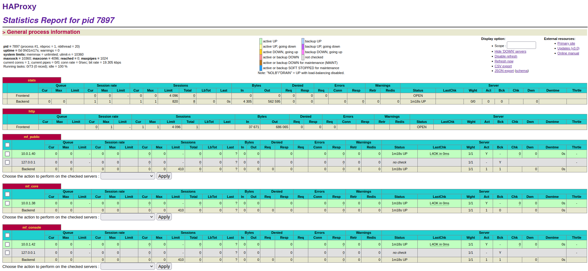
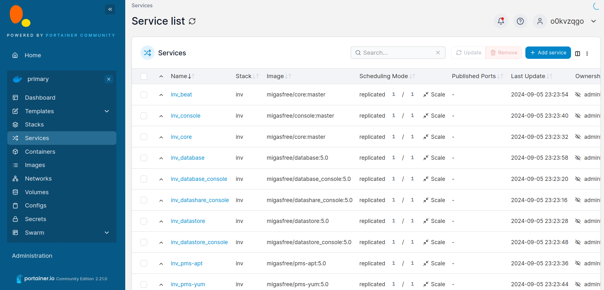
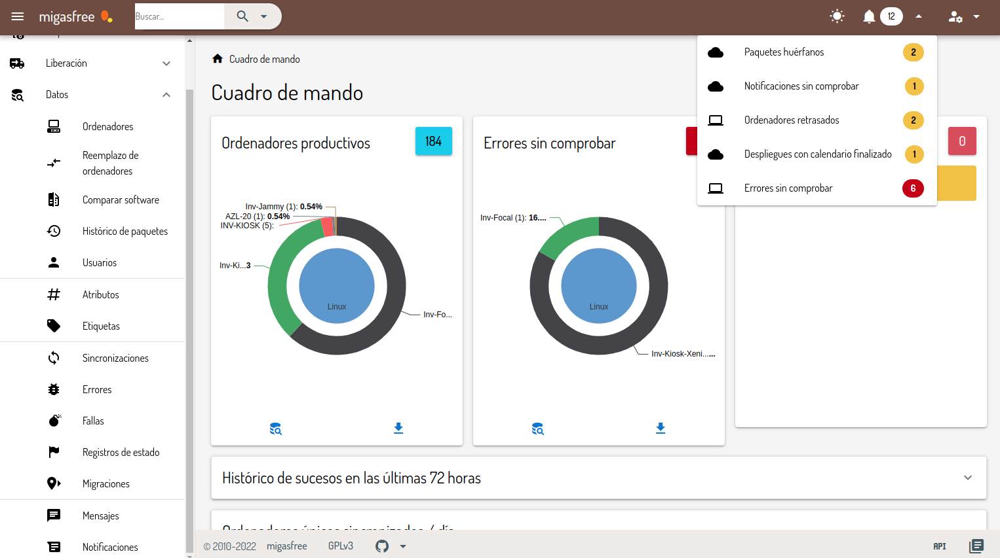
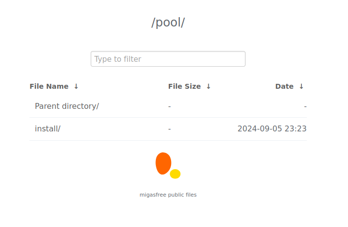
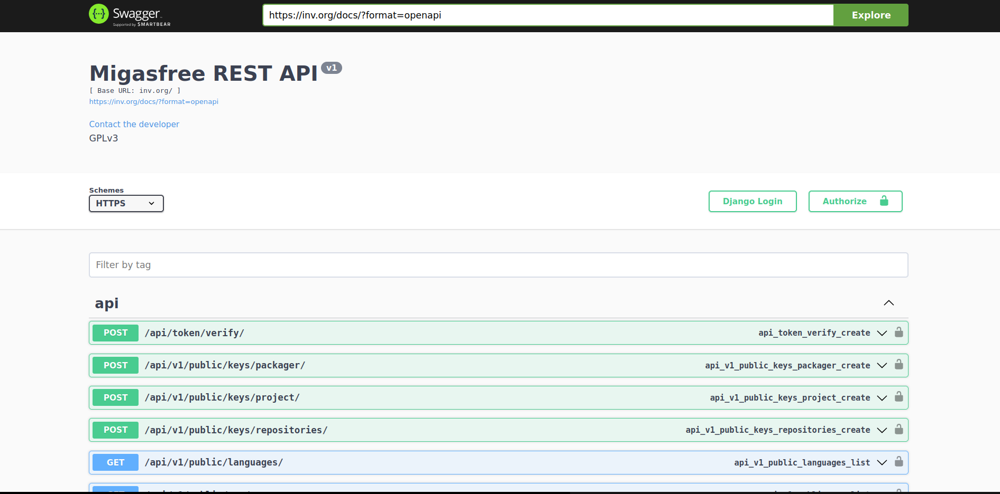
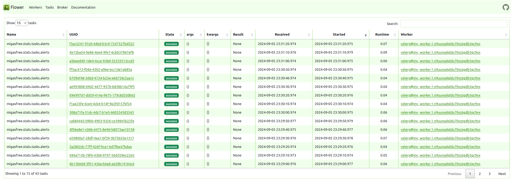
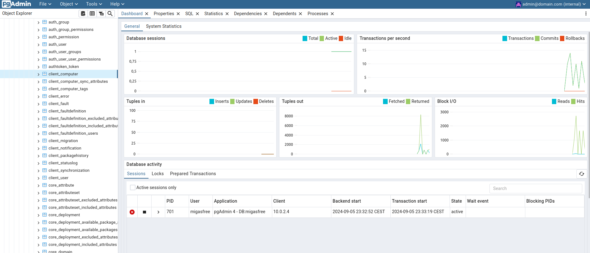
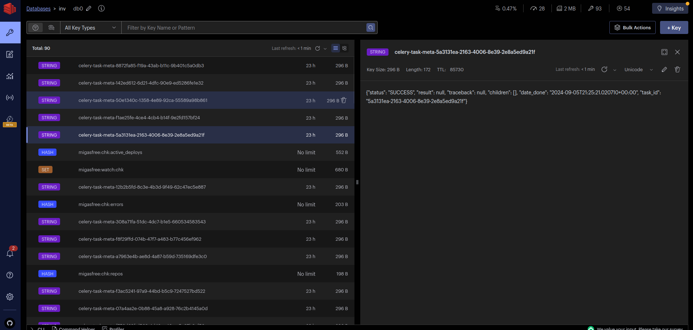
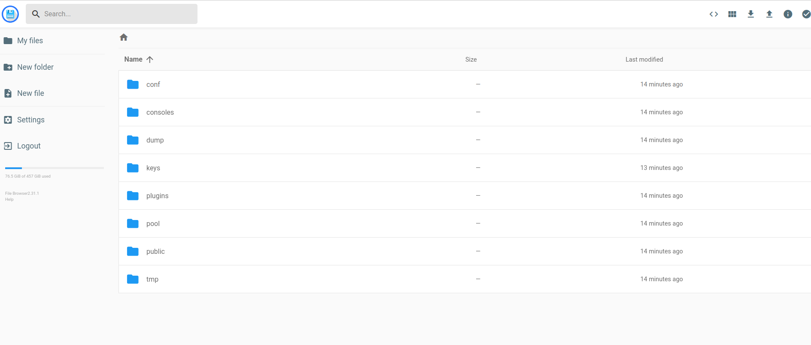

# Consoles 

To access the various consoles, navigate to `http://<FQDN>/services/status`

## proxy
  
  * [HAProxy](https://github.com/haproxy/haproxy) offers a detailed, real-time overview of the status and statistics of the servers and services being managed. This console is particularly useful for monitoring connection performance, request handling, response times, and the health of backend servers.

    
    
    
## portainer

* [Portainer](https://github.com/portainer/portainer) provides an easy-to-use interface for managing [Docker](https://github.com/docker) environments. It simplifies the process of deploying, managing, and troubleshooting containers within your infrastructure.

  

## console

* The [migasfree console](https://github.com/migasfree/migasfree-frontend) allows you to manage a `fleet of computers` by specifying which `packages` should be installed or removed based on the system's `attributes`. This console provides detailed control over the software environment of each machine.

  You can also retrieve extensive hardware and software information for each computer in the fleet.

  

## public pool

* Static files can be served for various purposes and made accessible at `https://<FQDN>/pool.`

  To upload files to this directory, go to`https://datashare.<FQDN>/files/pool/`

  

## core

* [Swagger UI](https://github.com/swagger-api/swagger-ui) lets you visualize and interact with the API provided by the [migasfree backend](https://github.com/migasfree/migasfree-backend) without needing any implementation logic.

  

## worker

* [Flower](https://github.com/mher/flower) is a real-time web-based tool for monitoring and managing [Celery](https://github.com/celery/celery) task queues. It provides insight into the status and health of Celery workers and tasks.

  

## database

* [pgAdmin](https://github.com/pgadmin-org/pgadmin4) is a powerful, user-friendly tool for administering and managing [PostgreSQL](https://github.com/postgres/postgres) databases.

  

## datastore

* [RedisInsight](https://github.com/RedisInsight/RedisInsight) provides a comprehensive and intuitive interface for managing [Redis](https://github.com/redis/redis) databases and optimizing their performance.

  

## datashare

* [Filebrowser](https://github.com/filebrowser/filebrowser) offers a simple yet effective web interface for managing files, making it easier to upload, download, and organize files.

  

