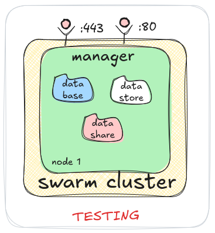
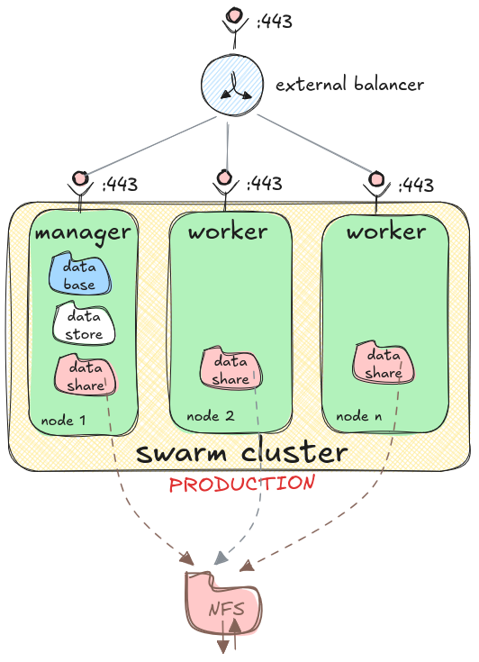

# Architecture Overview (Explanation)

This document provides a high-level explanation of the Migasfree Swarm infrastructure and its deployment strategies.

## Deployment Scenarios

### 1. Testing Environment Architecture

* The environment variable `DATASHARE_FS` should be set to `local`.
* All data is stored in `local volumes` on `node 1`.
* In this context, `datashare` refers to the volume named `migasfree-swarm`.

### 2. Production Environment Architecture

* The Swarm cluster handles both **port 80** and **port 443**; however, only port 443 is shown in the diagram for clarity.
* The environment variable `DATASHARE_FS` should be set to `nfs`.
* Data is stored on an `external NFS volume` outside the Swarm cluster, except for the `database volume` ([PostgreSQL](https://www.postgresql.org/)) and the `datastore volume` ([Redis](https://redis.io/)), which are kept local for better performance.
* In this context, `datashare` refers to the volume named `migasfree-swarm`, which is available on all nodes in the cluster.
* **Multiple network interfaces**: If the node has more than one interface, you must specify the `advertise-addr`, which is the IP address of the network interface connected to the cluster network.

## Component Relationships

The Migasfree Swarm stack consists of several interconnected microservices:

* **Proxy**: HAProxy layer for SSL termination and load balancing.
* **Public**: Nginx serving static files and repository files.
* **Core**: The central Django-based Migasfree management server.
* **Datastore**: Redis for real-time task queueing and state management.
* **Database**: PostgreSQL for persistent data.
* **Worker**: Background task processors.
* **Consoles**: Administrative interfaces for database, datastore, and cluster management.
