# MCI Image Builder Architecture (Explanation)

The **Migasfree Client Image (MCI) Builder** is a core background worker service integrated within the FastAPI-based **`manager`** stack component. It is responsible for orchestrating the compilation, generation, and packaging of customized partition images (like `SYSTEM.raw`) for client deployments.

The engine's logic is defined in [mci_builder.py](../../build/manager/defaults/usr/share/manager/core/mci_builder.py), which consumes tasks dispatched via a Redis-backed queue.

---

## ⚙️ Core Concepts & Terminology

Before exploring the architecture, it is important to understand the following concepts:

* **MCI (Migasfree Client Image)**: The overarching customized Linux distribution image designed for client machines. These images are consumed and deployed onto target client hardware using [migasfree-clone-system](https://github.com/migasfree/migasfree-clone-system).
* **MPI (Migasfree Partition Image)**: The specific partition-level `.raw` disk images (such as `SYSTEM.raw`) generated from a built Docker image, along with their metadata.
* **Flavour**: Custom profiles for the same core system configuration (e.g., specialized hostname, custom keyboard layout, user credentials, regional timezone, and hardware-specific package tags).
* **MCI Pool**: The final directory (`/pool/mci/`) where partition images, partition maps, and verification checksums are published to be served over HTTPS.

---

## 🔄 Architectural Workflow & Sequence

The MCI Builder operates as an asynchronous, event-driven background worker. The worker's lifespan is bound to the `manager` container lifecycle and started via the [start_mci_worker](../../build/manager/defaults/usr/share/manager/core/mci_builder.py#L694) function.

Below is the complete sequence of communication, database synchronization, image compilation, and metadata compilation:

```mermaid
sequenceDiagram
    autonumber
    participant R as "Redis (Datastore)"
    participant M as "Manager (mci_builder.py)"
    participant C as "Django Core (Django API)"
    participant D as "Docker Engine"
    participant FS as "Host Filesystem"
    
    Note over M: start_mci_worker() runs in background executor
    rect rgb(28, 33, 40)
        Note over M: Infinite worker polling loop
        M->>R: blpop(mci:build_queue)
        R-->>M: Return task_data (task_id, release_id)
    end
    
    Note over M: Task accepted, set task state to fetching in Redis
    M->>C: GET /token/mci/release/{id}/
    C-->>M: Return Release metadata & config_id
    M->>C: GET /token/mci/config/{id}/
    C-->>M: Return Config data (partition schema & Dockerfile template)
    M->>C: GET /token/mci/flavour/?config={id}
    C-->>M: Return list of flavours
    
    loop For each enabled Flavour in Config
        Note over M: Register build record in DB
        M->>C: POST /token/mci/build/
        C-->>M: Return build_record_id (status='running')
        
        Note over M: Generate Dockerfile from Jinja2 template & copy CA certificate
        M->>D: docker build --no-cache
        D-->>M: Return successful image build (image_tag)
        
        Note over M: Export to OCI & unpack using Skopeo + Umoci
        M->>FS: skopeo copy & umoci unpack (preserves file xattrs)
        
        Note over M: Configure network in unpacked rootfs (/etc/hostname, /etc/hosts, resolv.conf symlink)
        
        loop For each partition (e.g. SYSTEM)
            Note over M: Rootless ext4 raw image generation
            M->>FS: dd if=/dev/zero & mkfs.ext4 -d rootfs/{mount}
            M->>FS: e2fsck validation & resize2fs filesystem shrink
        end
        
        Note over M: Generate metadata (partition.yml & checksums.sha256)
        M->>FS: Move partition raw images & metadata to pool directory
        M->>FS: chown -R 890:890 (www-data) & update catalog.json
        
        Note over M: Clean up Docker image & temp build directory
        M->>C: PATCH /token/mci/build/{id}/ (status='completed', uri, size, logs)
    end
    
    Note over M: Set task status to completed in Redis
```



---

## 🛠️ Detailed Phase Breakdown

The build pipeline executed within [build_mci_image](../../build/manager/defaults/usr/share/manager/core/mci_builder.py#L493) contains several sophisticated infrastructure engineering solutions:

### 1. Zero Trust Authentication & Resource Fetching

The builder requires administrative rights to fetch image configs and report build statuses to Django Core.

* Credentials are securely loaded via Docker Secrets at runtime: `/run/secrets/{STACK}_superadmin_name` and `/run/secrets/{STACK}_superadmin_pass`.
* An authorization token is obtained dynamically via [_get_core_token](../../build/manager/defaults/usr/share/manager/core/mci_builder.py#L38-L63).
* Core interactions are handled by helper methods: [_get_core_resource](../../build/manager/defaults/usr/share/manager/core/mci_builder.py#L66-L86), [_post_core_resource](../../build/manager/defaults/usr/share/manager/core/mci_builder.py#L88-L113), and [_patch_core_resource](../../build/manager/defaults/usr/share/manager/core/mci_builder.py#L115-L140).

### 2. Sandbox Templating & Compilation

* **Dockerfile Templating**: A custom `Dockerfile` is compiled using Jinja2 in [generate_dockerfile](../../build/manager/defaults/usr/share/manager/core/mci_builder.py#L205-L236). It renders variables such as keyboard mappings, timezone, locale configurations, package tags, and custom credentials.
* **Internal CA Copying**: The Swarm cluster's self-signed root certificate (`ca-{FQDN}.crt`) is copied directly into the Docker build context to allow the resulting target OS to securely trust the Migasfree API.
* **Image Compilation**: The image is compiled in [build_docker_image](../../build/manager/defaults/usr/share/manager/core/mci_builder.py#L238-L295) with the `--no-cache` flag and a custom `CACHEBUST` build argument. Additionally, the cluster domain host mapping (`--add-host FQDN:FQDN_IP`) is injected to ensure the compiler can reach internal services if necessary.

### 3. Preserving Filesystem Capabilities (xattrs)

Standard extraction tools like `docker cp` or simple `tar` archives often discard extended file attributes (xattrs) and Linux filesystem capabilities (e.g. `CAP_NET_RAW` for `ping`). To bypass this limitation, the builder uses a two-step standard in [export_and_extract](../../build/manager/defaults/usr/share/manager/core/mci_builder.py#L297-L354):

1. **`skopeo copy`**: Copies the Docker daemon image to a localized OCI image layout bundle:

   ```bash
   skopeo copy docker-daemon:<image_tag> oci:<temp_oci_dir>:latest
   ```

2. **`umoci unpack`**: Unpacks the OCI bundle safely into a target directory structure:

   ```bash
   umoci unpack --image <temp_oci_dir>:latest <temp_bundle_dir>
   ```

   This preserves 100% of the underlying filesystem metadata, permissions, and security constraints.

### 4. Rootless Ext4 Disk Partition Generation

Creating filesystem disk images typically requires mounting loop devices, which mandates `root` privileges. To adhere strictly to container security best practices, the builder uses **rootless filesystem formatting** inside [_create_ext4_image_from_dir](../../build/manager/defaults/usr/share/manager/core/mci_builder.py#L356-L424):

1. **Size Evaluation & File Pre-allocation**: Measures the exact byte weight of the source directory via `du -sm`. It then pre-allocates a sparse raw block file using `dd`.

2. **Rootless Formatting & Injection**: Formats the pre-allocated raw image using `mkfs.ext4` with the directory-injection option (`-d`):

   ```bash
   mkfs.ext4 -F -d <source_rootfs_dir> <output_raw_image>
   ```

   This populates the ext4 filesystem directly from the source directory, entirely in user-space without any system mounts!

3. **Filesystem Cleanup & Structural Resizing**:
   * Runs `e2fsck -y -f` to repair and validate the block structure.
   * Leverages metadata extracted via `dumpe2fs -h` to compute the minimal block footprints.
   * Invokes `resize2fs` to shrink the partition image to its optimal size plus a targeted headroom buffer (e.g. 128 MB for the `SYSTEM` partition to accommodate kernel logs and dynamic runtime changes, or 8 MB for smaller partitions), minimizing storage usage and network transport times.

### 5. Partition Metadata & Catalog Synchronization

* **Metadata Export**: Writes partition layouts and UUID references to [generate_partition_yml](../../build/manager/defaults/usr/share/manager/core/mci_builder.py#L426-L430) (`partition.yml`) and computes cryptographical hashes with [generate_checksums](../../build/manager/defaults/usr/share/manager/core/mci_builder.py#L432-L452) (`checksums.sha256`).
* **Catalog Registration**: Reads and parses `catalog.json` from the pool structure, then appends or updates the release/flavour metadata in [update_catalog_json](../../build/manager/defaults/usr/share/manager/core/mci_builder.py#L454-L491).
* **Ownership Adjustment**: Chowns all generated files and pool directories to `890:890` (representing the non-privileged system user of the proxy / public webservers).
* **Core Callback Notification**: Patches the Core build record with the full public path URI, real file size, and standard output logs.

---

## 🗄️ Django Models & Core Schema

The backend configuration, state tracking, and persistence of the MCI ecosystem are managed by a dedicated Django application inside the Django Core service (`migasfree-backend`). The source models and REST serializer resources are defined in [migasfree-backend/mci](https://github.com/migasfree/migasfree-backend/tree/master/migasfree/mci).

The builder interacts with five fundamental Django models:

### 1. Project

Defines the main Migasfree Project mapping.

* **Fields Used**: `id`, `name`, `slug`.
* **Purpose**: Serves as the high-level grouping. The `slug` is used to determine directory paths and image tag basenames.

### 2. Config

Contains the build-system blueprint templates for a given Project.

* **Fields Used**: `id`, `project`, `base_os`, `dockerfile`, `partition`.
* **Purpose**: Stores the actual Jinja2-enabled Dockerfile template (defining packages, mirrors, and custom logic) and the YAML partition map detailing which folders map to target disk partitions.

### 3. Release

Tracks the release lifecycle of an image version.

* **Fields Used**: `id`, `config`, `name`, `enabled`.
* **Purpose**: Groups configurations under tag names (e.g. `v5.0`, `testing`) to compile a snapshot version.

### 4. Flavour

Provides regional or hardware-specific customizations of a configuration.

* **Fields Used**: `id`, `config`, `name`, `enabled`, `description`, `user`, `password`, `keymap`, `keyboard_model`, `charmap`, `codeset`, `timezone`, `hostname`, `tags`.
* **Purpose**: Allows compiled images to support multiple keyboard templates, localized credentials, local timezones, and packages specific to subsets of workstations.

### 5. Build

Audits and stores the compilation results of a compilation run.

* **Fields Used**: `id`, `release`, `flavour`, `task_id`, `status` (running/completed/failed), `started_at`, `finished_at`, `uri`, `size`, `log`.
* **Purpose**: Holds the history of all compiles, storing references to their output pools (HTTPS download link), final raw image byte counts, and full container compilation output logs.

---

## ⚡ Redis Task Integration

Tasks are managed in Redis via two principal data keys:

| Redis Key | Type | Purpose | Lifecycle Scope |
| :--- | :--- | :--- | :--- |
| `mci:build_queue` | **List** | Stores task payloads (`{"task_id": "...", "release_id": ...}`) waiting to be popped. | Populated by Django Core; popped by `manager`. |
| `mci:task:<task_id>` | **Hash** | Stores the progress of a build task: `status`, `progress` (0-100), `message`, `updated_at`. | Expires automatically after **24 hours** (86400s). |

---

## 🔒 Key Security Elements

1. **Least Privilege System Execution**: Standard host operations (image creation, catalog parsing, file packaging) run completely within the non-root containerized user space, avoiding dangerous `privileged: true` configurations in Docker Swarm.
2. **Secrets Protection**: Credentials for Core API access are loaded exclusively from `/run/secrets/` and never written to logs or disk.
3. **CA Certificate Propagation**: Installs the custom Root Certificate of the swarm directly into the compiled operating system, establishing a secure chain-of-trust for subsequent clients connecting back to the Migasfree ecosystem.
