# MCS ISO Builder Architecture (Explanation)

The **Migasfree Clone System (MCS) ISO Builder** is a background worker service integrated within the FastAPI-based **`manager`** stack component. It is responsible for orchestrating the compilation, generation, and packaging of the custom bootable MCS rescue/cloning environment (`mcs-<VERSION>.iso`).

The engine's logic is defined in [mcs_builder.py](../../build/manager/defaults/usr/share/manager/core/mcs_builder.py), which consumes tasks dispatched via a Redis-backed queue.

---

## ⚙️ Core Concepts & Terminology

Before exploring the architecture, it is important to understand the following concepts:

*   **MCS (Migasfree Clone System)**: The bootable utility (rescue/installer layout) flashed onto target workstation USBs or booted via PXE. It hosts the TUI client that connects back to the Migasfree server to fetch and clone partition images.
*   **Raw GPT Partition Disk Image**: Although named `.iso`, the MCS compiler generates a bootable raw disk image containing a complete **GPT partition table** with four internal partitions:
    1.  **ESP (EFI System Partition)**: `fat32` formatted, bootable EFI loader.
    2.  **BIOSBOOT (BIOS Boot Partition)**: 1 MiB partition enabling GRUB bootloading on legacy hardware.
    3.  **ROOT (Alpine Linux OS)**: `ext4` filesystem containing the operating system, network configuration, and cloning tools.
    4.  **DATA (User Settings)**: `ext4` partition (`/mcsdata`) storing persistency configs and local image caches.
*   **Virtual Loopback Loop devices**: Building a partitioned virtual disk image requires allocating and partitioning block devices. The builder binds `/dev` and uses `losetup` inside the environment to format and install boot sectors.

---

## 🔄 Architectural Workflow & Sequence

The MCS Builder operates as an asynchronous background worker. Its lifespan is bound to the `manager` container lifecycle and started via the [start_mcs_worker](../../build/manager/defaults/usr/share/manager/core/mcs_builder.py#L200) function.

Below is the complete sequence of communication, isolated sibling container initialization, chroot compilation, and delivery:

```mermaid
sequenceDiagram
    autonumber
    participant R as "Redis (Datastore)"
    participant M as "Manager (mcs_builder.py)"
    participant D as "Docker Engine"
    participant S as "Sibling Container (alpine:3.22)"
    participant FS as "Host Filesystem"
    
    Note over M: start_mcs_worker() runs in background executor
    rect rgb(28, 33, 40)
        Note over M: Infinite worker polling loop
        M->>R: blpop(mcs:build_queue)
        R-->>M: Return task_data (task_id, server_url, server_ip, keymap)
    end
    
    Note over M: Task accepted, set state to initializing
    M->>FS: Create temporary directory in datashares/tmp/mcs-build-{task_id}
    
    Note over M: Spun up isolated builder container as Sibling
    M->>D: docker run --privileged (alpine:3.22)
    D-->>S: Create Sibling Container running shell payload
    
    activate S
    Note over S: Install build tools (git, make, parted, docker-cli, etc.)
    S->>S: git clone migasfree-clone-system
    S->>S: Write server and keymap variables to mcs.conf
    S->>S: Run Makefile building routine (make build)
    
    rect rgb(38, 43, 50)
        Note over S: Inside Nested Docker:
        S->>D: docker build -t migasfree/mcs & allocate loop loopback
        S->>S: Format loop partitions (FAT32, ext4)
        S->>S: Alpine rootfs installation (chroot / apk / grub-install)
    end
    
    S->>FS: Copy finalized mcs-<VERSION>.iso to pool/mcs/
    S->>FS: chown -R 890:890 (www-data permissions)
    deactivate S
    
    D-->>M: Sibling container terminates cleanly
    
    Note over M: Verify file in pool, set status to completed in Redis
    M->>FS: Clean up datashares/tmp/mcs-build-{task_id}
```

---

## 🛠️ Detailed Sibling Container Isolation

To maintain the **thinness** and **security** of the `manager` container image, no heavy build utilities (like `parted`, `rsync`, or compilation libraries) are installed directly on it. Instead, the manager acts purely as an orchestrator using the **Sibling Container Pattern**:

1.  **Docker-in-Docker Socket Sharing**: The manager maps the host's `/var/run/docker.sock` to spin up a sibling `alpine:3.22` container.
2.  **Host Path Mirroring**: Mounts the host's volume path `/var/lib/docker/volumes/migasfree-swarm/_data` to the exact same path inside the sibling container. This ensures that any path reference resolved by the manager matches the host filesystem structure exactly.
3.  **Privileged Mode and Loop Devices**: Generating partition tables and running `grub-install` requires direct access to kernel block devices. The sibling container is executed in `--privileged` mode and maps `-v /dev:/dev` to safely create, register, format, and detach virtual loopback devices without compromising the core `manager` stack.

---

## ⚡ Redis Task & API Integration

Tasks are managed in Redis via two principal data keys:

| Redis Key | Type | Purpose | Lifecycle Scope |
| :--- | :--- | :--- | :--- |
| `mcs:build_queue` | **List** | Stores task payloads (`{"task_id": "...", "server_url": ...}`) waiting to be popped. | Populated by API; popped by `manager`. |
| `mcs:task:<task_id>` | **Hash** | Stores the progress of a build task: `status`, `progress` (0-100), `message`, `updated_at`. | Expires automatically after **24 hours** (86400s) (refreshed on updates). |

### FastAPI Endpoints

1.  **Post Build**: `POST /manager/v1/private/mcs/build` (Requires Superuser)
    *   **Parameterless-by-Default**: The body is optional. If empty, it automatically detects the stack's FQDN, FQDN_IP, and defaults the keyboard layout to Spanish (`"es"`).
2.  **Get Status**: `GET /manager/v1/private/mcs/build/{task_id}/status`
    *   Returns the real-time progress percentages and system chroot logging status.

---

## 🔄 Automatic Sequential MCS Build Trigger

To provide an optimal out-of-the-box experience (handling the "chicken-and-egg" bootstrapping problem), the **MGI Builder** is integrated with the **MCS Builder** dynamically:

1.  **MGI Initialization Check**: At the start of any MGI image compilation (`build_mgi_image`), the manager checks `/pool/mcs/` for any `.iso` files.
2.  **Asynchronous Auto-Triggering**: If the pool contains no bootable ISOs, the manager enqueues a default MCS build task sequentially inside `mcs:build_queue` in Redis.
3.  **Resource Contention Avoidance**: Because tasks are processed sequentially/asynchronously by independent background threads, CPU and I/O congestion is completely avoided, maintaining smooth system performance.
