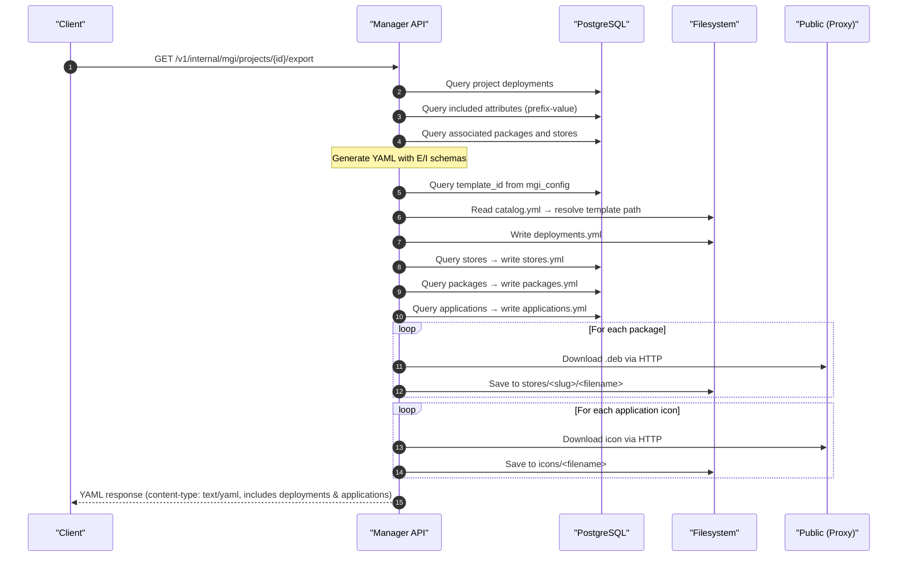
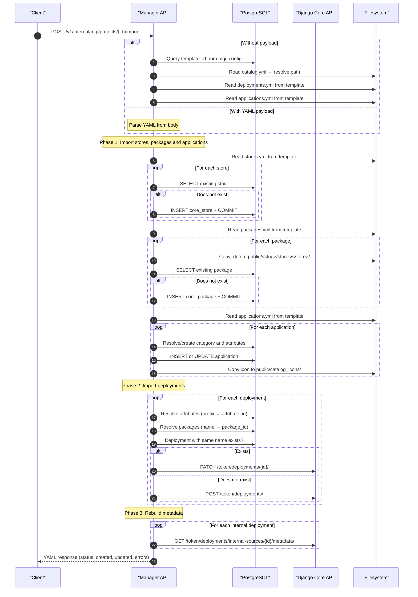
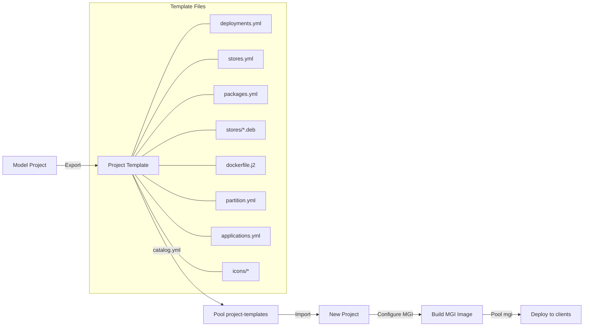

# MGI Deployment Export & Import (Explanation)

The **MGI Deployment Export/Import** system enables replicating the complete configuration of deployments, stores, and packages between Migasfree projects. It is designed so that a new project can automatically inherit the software repositories configured in a model project, streamlining the setup of new projects.

The endpoints are defined in [mgi_templates.py](../../build/manager/defaults/usr/share/manager/routers/mgi_templates.py) and are registered under the internal router (`/v1/internal/mgi`).

---

## 📋 Core Concepts

| Concept | Description |
| :--- | :--- |
| **External Deployment (source=E)** | External APT/YUM repository (e.g. `ftp.debian.org`). Defines base URL, suite, components, and signing options. |
| **Internal Deployment (source=I)** | Migasfree-managed internal repository. Contains custom `.deb` packages stored in stores. |
| **Store** | Logical storage unit within a project where packages are grouped (e.g. `thirds`, `org`, `updates`). |
| **Project Template** | Base template associated with a project via `mgi_config`. Defines the OS family, Dockerfile, and default deployments. |
| **Catalog (`catalog.yml`)** | Index of available Project templates, mapping each `template_id` to its path on disk. |

---

## 🏗️ File Structure

The export generates a set of YAML files and binary packages inside the template directory:

```text
pool/project-templates/
├── catalog.yml                          # Template index
└── <family>/<version>/                  # E.g.: debian/13/
    ├── dockerfile.j2                    # Dockerfile template (Jinja2)
    ├── partition.yml                    # Partition schema
    ├── deployments.yml                  # Exported deployments
    ├── stores.yml                       # Project stores
    ├── packages.yml                     # Package metadata
    ├── applications.yml                 # Application catalog (optional)
    ├── stores/                          # Binary packages
    │   └── <store_slug>/               # E.g.: thirds/
    │       ├── migasfree-client_5.0-1_all.deb
    │       └── migasfree-agent_1.0.11_all.deb
    └── icons/                           # Application icons (optional)
        └── app_<id>.png
```

---

## 📤 Export (`GET /v1/internal/mgi/projects/{project_id}/export`)

### Export Description

Exports all internal and external deployments and applications of a project in YAML format. Simultaneously persists the files to the corresponding Project template directory.

### Export Execution Flow



### What Gets Exported

| Data | Exported? | Notes |
| :--- | :---: | :--- |
| Deployment name | ✅ | `name` field |
| State (enabled) | ✅ | `enabled` field |
| Included attributes | ✅ | As `PREFIX-Value` only (e.g. `SET-All Systems`) |
| Excluded attributes | ❌ | Not exported |
| Schedule | ❌ | Not exported |
| Domain | ❌ | Not exported |
| Stores | ✅ | In `stores.yml` |
| Packages (metadata) | ✅ | In `packages.yml` |
| Packages (binary .deb) | ✅ | Downloaded to `stores/<slug>/` |
| Applications (metadata) | ✅ | In `applications.yml` |
| Application icons | ✅ | Downloaded to `icons/` |

### Destination Directory Resolution

1. Queries `mgi_config.template_id` for the project
2. Uses `template_id` directly as the directory name (no catalog lookup needed)
3. **Fallback**: If no template is configured, uses the project's `slug`

---

## 📥 Import (`POST /v1/internal/mgi/projects/{project_id}/import`)

### Import Description

Imports deployments, stores, and packages into a target project. It is **idempotent**: updates existing deployments (by name matching) and creates new ones.

### Invocation Modes

| Mode | Description |
| :--- | :--- |
| **With YAML payload** | Sends the YAML directly in the POST body |
| **Without payload** | Automatically loads from the associated template's `deployments.yml` |

```bash
# Mode 1: Without payload (uses project template)
curl -X POST https://server/manager/v1/internal/mgi/projects/6/import -d ''

# Mode 2: With explicit payload
curl -X POST https://server/manager/v1/internal/mgi/projects/6/import \
  -H "Content-Type: text/yaml" \
  --data-binary @deployments.yml
```

### Import Execution Flow



### Automatic Template Resolution (without payload)

The resolution follows this priority chain:

1. **`mgi_config.template_id`** → uses the `template_id` as directory name → reads `deployments.yml` from that subdirectory
2. **Remote registry**: If not found locally, attempts to download from `MGI_TEMPLATES_URL`
3. **Slug fallback**: Looks in `pool/project-templates/<project_slug>/deployments.yml`
4. **Error 400**: If no source has data

---

## 📐 YAML Schemas

### External Deployment (`source: E`)

```yaml
- name: BASE                              # Deployment name
  enabled: true                           # Enabled/disabled
  base_url: http://ftp.debian.org/debian/ # Repository base URL
  suite: bookworm                         # Suite/distribution
  components: main contrib non-free       # APT components
  options: '[ Signed-By=/usr/share/keyrings/debian-archive-keyring.gpg ]'
  frozen: true                            # Frozen (no updates)
  included_attributes:                    # Attributes as PREFIX-Value
    - SET-All Systems
  source: E                               # Type: External
```

### Internal Deployment (`source: I`)

```yaml
- name: migasfree                         # Deployment name
  enabled: true                           # Enabled/disabled
  comment: Migasfree packages             # Descriptive comment
  available_packages:                     # Packages available in the repo
    - migasfree-client
    - migasfree-agent
  packages_to_install:                    # Packages to install automatically
    - migasfree-client
  packages_to_remove: []                  # Packages to uninstall
  included_attributes:                    # Attributes as PREFIX-Value
    - SET-All Systems
  store: thirds                           # Associated store slug
  source: I                               # Type: Internal
```

### `stores.yml`

```yaml
stores:
  - name: thirds
    slug: thirds
  - name: org
    slug: org
```

### `packages.yml`

```yaml
packages:
  - fullname: migasfree-client_5.0-1_all.deb
    name: migasfree-client
    version: 5.0-1
    architecture: all
    store: thirds                # Store slug where the package resides
    project_slug: lnx-1         # Source project slug
  - fullname: migasfree-agent_1.0.11_all.deb
    name: migasfree-agent
    version: 1.0.11
    architecture: all
    store: thirds
    project_slug: lnx-1
```

---

## 🔄 Import Response

The response is returned in YAML format:

```yaml
# Successful import
status: success
created: 4        # New deployments created
updated: 2        # Existing deployments updated
errors: []        # Empty list if everything succeeded

# Partial import (HTTP 207)
status: partial_success
created: 3
updated: 1
errors:
  - "Failed to create 'CUSTOM': HTTP 400 - Invalid field"
```

---

## ⚠️ Important Considerations

### Idempotency

The import is fully idempotent:

- **Stores**: Created only if one with the same slug does not already exist (case-insensitive comparison).
- **Packages**: Registered only if one with the same `fullname` does not already exist in the same store.
- **Deployments**: If one with the same name exists, it is updated (PATCH); otherwise, it is created (POST).

### Metadata Rebuild

After importing all deployments, a metadata rebuild is automatically triggered for every internal deployment (`source=I`). This generates the APT index files required for clients to install packages from the internal repository.

### Database Transactions

Direct insertions into PostgreSQL (stores and packages) use explicit `conn.commit()` after each write operation. This is necessary because `psycopg2` operates in transactional mode by default, and without a commit the insertions would be discarded when the connection is closed.

### Fields Not Exported

The following deployment fields are **not exported** by design:

- **Schedule (`schedule`)**: Specific to the production environment.
- **Domain (`domain`)**: Specific to the organization.
- **Excluded attributes**: Not considered portable between projects.
- **Numeric IDs**: Resolved dynamically during import.

---

## 🌐 Django Core (Public REST API) Endpoints

The internal endpoints in the `manager` service are exposed to administrators and frontend applications through a secure proxy layer in Django Core. These endpoints are documented in the **Swagger/OpenAPI** schema and require a token-based authentication header (`Authorization: Token <token>`).

### 1. Catalog / Templates Discovery

#### List Templates Catalog

- **Endpoint**: `GET /api/v1/token/projects/templates/`
- **Description**: Lists all MGI templates available, querying both local templates (`pool/project-templates`) and remote templates (configured in `MGI_TEMPLATES_URL`).

#### Retrieve Template Details

- **Endpoint**: `GET /api/v1/token/projects/templates/{template_id}/`
- **Description**: Returns the comprehensive metadata for a specific template (including base OS, partition schema, Dockerfile contents, and preconfigured project fields: `platform`, `pms`, and `architecture`).

### 2. Unified Template Import

#### Import Template to Existing or New Project

- **Endpoint**: `POST /api/v1/token/projects/templates/import/`
- **Description**: Initiates a template import workflow.

  - **To create a new project**: Pass `project_name` (string)
  - **To update an existing project**: Pass `project_id` (integer)
  - **Optional parameter**: Pass `origin` (string: `'local'` or `'remote'`) to specify the template source catalog.

- **Payload Examples**:

  - **Option A: Auto-create a new project**:

    ```json
    {
      "template_id": "debian-13-desktop",
      "project_name": "My New Brand Project",
      "origin": "local"
    }
    ```

  - **Option B: Import into an existing project**:

    ```json
    {
      "template_id": "debian-13-desktop",
      "project_id": 45,
      "origin": "local"
    }
    ```

### 3. Unified Template Export

#### Export Project to MGI Template Pool

- **Endpoint**: `POST /api/v1/token/projects/templates/export/`
- **Description**: Triggers an export of the project's deployments, stores, and packages to the template catalog directory (`pool/project-templates/`). During the process, the project's own `platform`, `pms`, and `architecture` fields are serialized and persisted into the template's `catalog.yml`.
- **Payload Example**:

  ```json
  {
    "project_id": 45
  }
  ```

---

## 🗺️ Relationship with the MGI Lifecycle

The deployment export/import integrates into the overall MGI workflow:



1. Configure a **model project** with the desired deployments, stores, and packages.
2. **Export** the configuration, which is stored as Project template files.
3. When creating a **new project**, associate it with the same template via `mgi_config`.
4. **Import** the configuration, replicating the entire repository infrastructure.
5. The project is ready to build MGI images with its preconfigured deployments.
