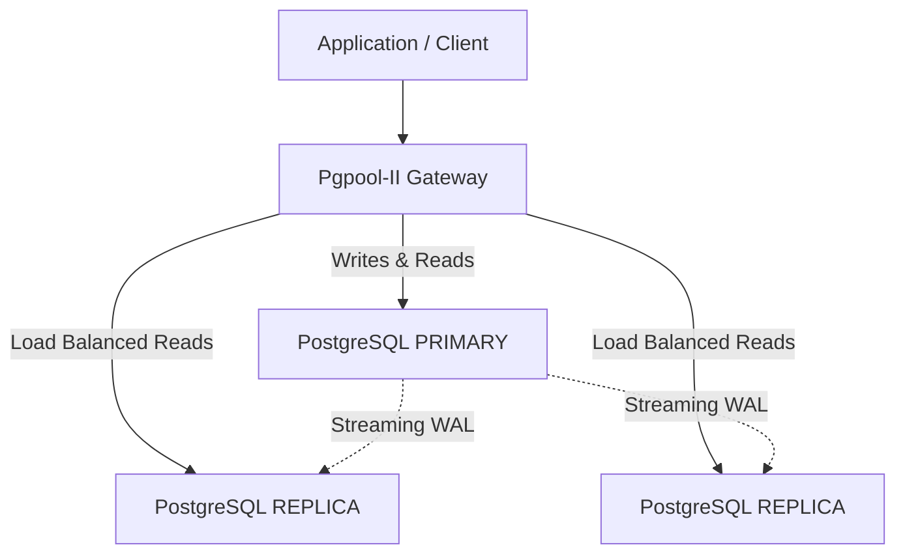

# PostgreSQL High Availability & Replication (Pgpool-II)

Migasfree Swarm implements a robust **High Availability (HA)** architecture using **Pgpool-II** as a gateway and **PostgreSQL Streaming Replication** for data consistency.

## Architecture

The system consists of a `database` service running in `global` mode and a `pgpool` service acting as the intelligent entry point for all database traffic.

### 1. Pgpool-II (The Gateway)

Pgpool-II is the single point of entry for the application. It provides:

- **Load Balancing**: Distributes read-only queries across all available Replicas.
- **Failover Management**: Automatically detects a Primary failure and promotes a new main node (or stops writes to protect data).
- **Auto-Failback**: Automatically re-integrates recovered database nodes into the cluster without manual intervention.
- **Connection Pooling**: Reduces overhead by reuse of database connections.

### 2. PostgreSQL (The Storage)

Deployed as a `global` service, meaning every eligible node runs a database instance.

- **Primary Node**: The source of truth. Designated via `PRIMARY_IP`.
- **Standby Nodes (Replicas)**: Synchronize in real-time using Streaming Replication from the Primary.



## Configuration

The cluster is defined by static IPs to ensure stability within the Swarm overlay network.

| Variable | Description |
| :--- | :--- |
| `PRIMARY_IP` | The static IP of the node acting as the master database. |
| `REPLICAS_IP` | Comma-separated list of static IPs for standby nodes. |

> **IMPORTANT**: For Pgpool-II to reach the database nodes via these static IPs, the `database` service MUST publish its port in **host mode**. The variable that configures this port is `PORT_DATABASE`. Without this being correctly set, Pgpool will be unable to connect and will remain in a wait loop.
>
> **SECURITY WARNING**: Exposing `PORT_DATABASE` on the host makes the database accessible to anyone with network access to the node. **DO NOT expose this port to the public internet**. Use a firewall (iptables/ufw) to restrict access solely to the IPs of the cluster nodes or connect via a secure VPN.

### Startup Logic

- **Wait-for-Primary**: Pgpool-II will not start until the `PRIMARY_IP` is reachable on port 5432. This prevents "blind" starts where the gateway is up but has nowhere to send writes.
- **Permissive Replicas**: Standby nodes are checked at startup. If they are down, Pgpool-II will still start (provided the Primary is UP) and wait for the Auto-Attach logic to pick them up later.

## Failover & Recovery Strategy

In Migasfree Swarm, database failover is handled following **Infrastructure as Code** principles. If the Primary node fails, the recovery process is declarative and safe.

### 1. Handling Primary Failure

When the Primary node becomes unavailable:

1. **Identify a new Primary**: Choose one of your healthy Standby (Replica) nodes to become the new boss.
2. **Update Configuration**: Edit your `env.py` file and update the `POSTGRES_PRIMARY_NODE` variable with the hostname of the chosen node.

    ```python
    POSTGRES_PRIMARY_NODE = 'worker-node-02'
    ```

3. **Redeploy**: Run the deployment command from the Manager node:

    ```bash
    ./migasfree-swarm deploy
    ```

### 2. The Auto-Promotion Process

When you redeploy with a new `POSTGRES_PRIMARY_NODE`, the following happens automatically:

- The database container on the designated node detects it should now be the Primary.
- It finds an existing `standby.signal` file (indicating it was previously a replica).
- It automatically executes `pg_ctl promote`, removes the standby signal, and opens for writes.
- The gateway (Pgpool-II or HAProxy) detects the new primary and resumes traffic.

### 3. Re-integrating the Old Primary

When the failed node comes back online:

- It will start as a **Replica** (because the `env.py` now says so).
- The entrypoint will detect that its local data is "dirty" (it was a primary before).
- For safety and consistency, it will **wipe its local data** and perform a fresh `pg_basebackup` from the current Primary.
- It joins the cluster as a healthy, synchronized Standby.

> **Note**: Manual promotion via `pg_ctl promote` is discouraged as it can lead to "Split-Brain" scenarios. Always use the `env.py` update and redeploy flow to ensure the cluster state matches your configuration.

## Automatic Recovery (Auto-Attach)

Migasfree Swarm includes a lightweight **Auto-Attach** background process within the Pgpool container:

1. It monitors the status of all configured backends every 15 seconds.
2. If a node is marked as `DOWN` in Pgpool but its port `5432` is reachable, the process automatically triggers a `pcp_attach_node` command.
3. This allows nodes to join the cluster automatically after a reboot, network flicker, or maintenance, achieving a "self-healing" state.

## Failover Operations

### Automatic Failback

With `auto_failback = on`, when a previously failed node comes back online, it is automatically re-attached as a standby.

### Manual Node Management

If manual intervention is required, use the `PCP` (Pgpool Control Protocol) tools via the container:

```bash
# Check node status
docker exec -it <pgpool_cid> pcp_node_info -h localhost -U migasfree -w

# Manually attach a node
docker exec -it <pgpool_cid> pcp_attach_node -h localhost -U migasfree -w <node_id>
```

## Security

- **Authentication**: Pgpool-II uses `pool_hba.conf` and `pool_passwd` (SCRAM-SHA-256) to secure connections.
- **Internal Traffic**: All replication and health-check traffic remains within the internal Swarm overlay network.
- **Secrets Management**: Database and PCP credentials are managed via Docker Secrets (`<stack>_superadmin_pass`).
